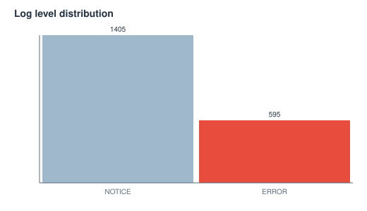
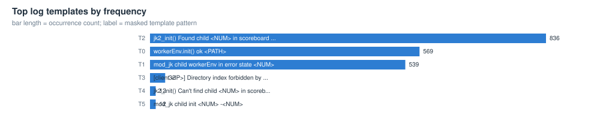
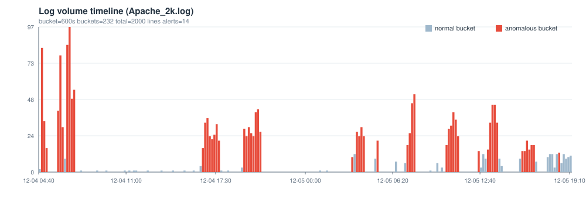

# Apache_2k 日志解析与异常检测报告

> 自动生成于 2026-10-06 00:56:46 ｜ 工具 loglens v0.1.0 ｜ 数据文件 data/Apache_2k.log

## 0 结论速览

- **解析**：2000 行原始日志，结构化解析 2000 行，解析率 100.00%（自动识别格式 apache，编码 utf-8）
- **模板**：6 个模板（单例模板 0 个），时间桶宽 10min，共 232 个桶
- **异常**：检出 14 个异常窗口（high 10 / medium 4 / low 0），单点判定 362 条，各检测器：ewma=8, novelty=2, poisson=97, robust_z=148, rules=107
- **最值得先看**：窗口 12-04 16:30:00 ~ 17:40:00（约 1.3 小时）；模板 T2 计数异常（观测 17 次 / 基线 3.55 次）；出现 2 个观察期后的新模板；规则命中 error-level；量级突变 error-volume-up/volume-up；检测器 ewma+novelty+poisson+robust_z+rules

## 1 数据概览

| 指标 | 值 | 指标 | 值 |
|---|---|---|---|
| 文件 | data/Apache_2k.log | 格式 | apache（匹配率 1.000） |
| 原始行数 | 2000 | 空行 | 0 |
| 解析记录 | 2000 | 兜底行 | 0 |
| 解析率 | 100.00% | 编码 | utf-8 |
| 时间范围 | 2005-12-04 04:47:44 ~ 2005-12-05 19:15:57 | 跨度 | 1.6d |
| 时间桶宽 | 10min | 桶数 | 232 |

### 1.1 级别与来源分布

**级别分布**

| 级别 | 条数 | 占比 |
|---|---|---|
| NOTICE | 1405 | 70.2% |
| ERROR | 595 | 29.8% |

**来源 Top 10（logger / 进程）**

| 来源 | 条数 | 占比 |
|---|---|---|
| httpd | 2000 | 100.0% |




## 2 模板挖掘（时间/级别/来源/事件形态）

解析层负责把时间、级别、来源抽成字段；模板层负责把正文里的变量（block id、IP、数字、路径…）掩码后聚类成有限个「事件形态」，这是后续所有统计检验的坐标系。

| 模板 | 形态（已掩码） | 次数 | 占比 | 首次出现 | 末次出现 | 主要级别 |
|---|---|---|---|---|---|---|
| T2 | [jk2_init() Found child <NUM> in scoreboard slot <NUM>] | 836 | 41.8% | 2005-12-04 04:51:08 | 2005-12-05 19:15:55 | NOTICE |
| T0 | [workerEnv.init() ok <PATH>] | 569 | 28.4% | 2005-12-04 04:47:44 | 2005-12-05 19:15:57 | NOTICE |
| T1 | [mod_jk child workerEnv in error state <NUM>] | 539 | 26.9% | 2005-12-04 04:47:44 | 2005-12-05 19:15:57 | ERROR |
| T3 | [[client <IP>] Directory index forbidden by rule: <PATH>] | 32 | 1.6% | 2005-12-04 05:15:09 | 2005-12-05 19:14:09 | ERROR |
| T4 | [jk2_init() Can't find child <NUM> in scoreboard] | 12 | 0.6% | 2005-12-04 17:43:08 | 2005-12-05 11:06:52 | ERROR |
| T5 | [mod_jk child init <NUM> -<NUM>] | 12 | 0.6% | 2005-12-04 17:43:12 | 2005-12-05 11:06:52 | ERROR |




## 3 异常检测结果

### 3.1 检测器与参数

| 检测器 | 方法 | 阈值/规则 |
|---|---|---|
| 稳健 z-score（模板计数） | MAD 估计 sigma | z >= 5.0，且计数 >= max(3, 中位数+3.0) |
| 泊松尾检验 | 上尾概率 + BH-FDR | p <= 0.01 粗筛，FDR q = 0.05，基线速率 >= 0.05 |
| EWMA 控制图 | 指数加权均值/方差 | lambda = 0.25，控制限 L = 4.0 |
| 新模板（novelty） | 观察期后首次出现 | 观察期 = 前 10% 时间桶 |
| 规则（关键词/级别） | 运维经验规则表 | 命中阈值按规则配置；权重上限 1.2 |
| 窗口融合 | 加权求和 | 桶分数 >= 1.0 判为异常桶，连续异常桶合并为事件 |

| 检测器 | 单点判定数 |
|---|---|
| robust_z | 148 |
| rules | 107 |
| poisson | 97 |
| ewma | 8 |
| novelty | 2 |

### 3.2 异常窗口（事件）列表

| 序号 | 开始 | 结束 | 时长 | 分数 | 严重度 | 检测器 | 涉及模板 | 摘要 |
|---|---|---|---|---|---|---|---|---|
| #1 | 2005-12-04 16:30:00 | 2005-12-04 17:40:00 | 1.3h | 6.20 | high | ewma,novelty,poisson,robust_z,rules | T2,T0,T1,T4,T5 | 窗口 12-04 16:30:00 ~ 17:40:00（约 1.3 小时）；模板 T2 计数异常（观测 17 次 / 基线 3.55 次）；出现 2 个观察期后的新模板；规则命中 error-level；量级突变 error-volume-up/volume-up；检测器 ewma+novelty+poisso... |
| #2 | 2005-12-04 04:50:00 | 2005-12-04 05:10:00 | 30min | 5.70 | high | ewma,poisson,robust_z,rules | T0,T1,T2 | 窗口 12-04 04:50:00 ~ 05:10:00（约 30 分钟）；模板 T0 计数异常（观测 26 次 / 基线 2.35 次）；规则命中 error-level/jk-error；量级突变 error-volume-up/volume-up；检测器 ewma+poisson+robust_z+rules |
| #3 | 2005-12-04 19:30:00 | 2005-12-04 20:40:00 | 1.3h | 5.30 | high | ewma,poisson,robust_z,rules | T0,T2,T1 | 窗口 12-04 19:30:00 ~ 20:40:00（约 1.3 小时）；模板 T2 计数异常（观测 23 次 / 基线 3.52 次）；规则命中 error-level；量级突变 error-volume-up/volume-up；检测器 ewma+poisson+robust_z+rules |
| #4 | 2005-12-04 06:00:00 | 2005-12-04 06:20:00 | 30min | 4.20 | high | poisson,robust_z,rules | T2,T0,T1 | 窗口 12-04 06:00:00 ~ 06:20:00（约 30 分钟）；模板 T0 计数异常（观测 23 次 / 基线 2.36 次）；规则命中 error-level/jk-error；检测器 poisson+robust_z+rules |
| #5 | 2005-12-04 06:40:00 | 2005-12-04 07:10:00 | 40min | 4.20 | high | poisson,robust_z,rules | T2,T0,T1 | 窗口 12-04 06:40:00 ~ 07:10:00（约 40 分钟）；模板 T0 计数异常（观测 23 次 / 基线 2.36 次）；规则命中 error-level/jk-error；检测器 poisson+robust_z+rules |
| #6 | 2005-12-05 07:20:00 | 2005-12-05 07:50:00 | 40min | 4.20 | high | poisson,robust_z,rules | T0,T1,T2 | 窗口 12-05 07:20:00 ~ 07:50:00（约 40 分钟）；模板 T2 计数异常（观测 22 次 / 基线 3.52 次）；规则命中 error-level/jk-error；检测器 poisson+robust_z+rules |
| #7 | 2005-12-05 13:10:00 | 2005-12-05 13:50:00 | 50min | 4.20 | high | poisson,robust_z,rules | T0,T1,T2 | 窗口 12-05 13:10:00 ~ 13:50:00（约 50 分钟）；模板 T2 计数异常（观测 23 次 / 基线 3.52 次）；规则命中 error-level/jk-error；检测器 poisson+robust_z+rules |
| #8 | 2005-12-05 03:40:00 | 2005-12-05 04:10:00 | 40min | 3.80 | high | poisson,robust_z,rules | T2,T0,T1 | 窗口 12-05 03:40:00 ~ 04:10:00（约 40 分钟）；模板 T2 计数异常（观测 17 次 / 基线 3.55 次）；规则命中 error-level；检测器 poisson+robust_z+rules |
| #9 | 2005-12-05 10:10:00 | 2005-12-05 11:00:00 | 1h | 3.80 | high | poisson,robust_z,rules | T2,T0,T1 | 窗口 12-05 10:10:00 ~ 11:00:00（约 1.0 小时）；模板 T2 计数异常（观测 18 次 / 基线 3.54 次）；规则命中 error-level；检测器 poisson+robust_z+rules |
| #10 | 2005-12-05 15:40:00 | 2005-12-05 16:30:00 | 1h | 3.80 | high | poisson,robust_z,rules | T2,T0,T1 | 窗口 12-05 15:40:00 ~ 16:30:00（约 1.0 小时）；模板 T2 计数异常（观测 12 次 / 基线 3.57 次）；规则命中 error-level；检测器 poisson+robust_z+rules |
| #11 | 2005-12-05 03:20:00 | 2005-12-05 03:20:00 | 10min | 2.30 | medium | ewma,rules |  | 窗口 12-05 03:20:00 ~ 03:20:00（约 10 分钟）；规则命中 error-level；量级突变 error-volume-up/volume-up；检测器 ewma+rules |
| #12 | 2005-12-05 05:10:00 | 2005-12-05 05:10:00 | 10min | 1.80 | medium | poisson,robust_z,rules | T2 | 窗口 12-05 05:10:00 ~ 05:10:00（约 10 分钟）；模板 T2 计数异常（观测 13 次 / 基线 3.56 次）；规则命中 error-level；检测器 poisson+robust_z+rules |
| #13 | 2005-12-05 12:30:00 | 2005-12-05 12:30:00 | 10min | 1.80 | medium | robust_z,rules | T2 | 窗口 12-05 12:30:00 ~ 12:30:00（约 10 分钟）；模板 T2 计数异常（观测 6 次 / 基线 0.0 次）；规则命中 error-level；检测器 robust_z+rules |
| #14 | 2005-12-05 18:20:00 | 2005-12-05 18:20:00 | 10min | 1.80 | medium | robust_z,rules | T2 | 窗口 12-05 18:20:00 ~ 18:20:00（约 10 分钟）；模板 T2 计数异常（观测 5 次 / 基线 0.0 次）；规则命中 error-level；检测器 robust_z+rules |




### 3.3 重点异常窗口证据

#### 事件 #1 ｜ 2005-12-04 16:30:00 ~ 2005-12-04 17:40:00 ｜ 分数 6.20 ｜ high

**摘要**：窗口 12-04 16:30:00 ~ 17:40:00（约 1.3 小时）；模板 T2 计数异常（观测 17 次 / 基线 3.55 次）；出现 2 个观察期后的新模板；规则命中 error-level；量级突变 error-volume-up/volume-up；检测器 ewma+novelty+poisson+robust_z+rules

**判断依据**

- 模板 T2 本桶 17 次，基线速率 3.545 次/桶（放大 4.8 倍），泊松上尾 p = 2.23e-07，在 212 次检验中经 BH-FDR(q=0.05) 校正后仍显著
- 模板 T2 本桶 16 次，基线速率 3.55 次/桶（放大 4.5 倍），泊松上尾 p = 1.10e-06，在 212 次检验中经 BH-FDR(q=0.05) 校正后仍显著
- 模板 T2 在本桶出现 17 次，历史中位数 0.0 次，稳健 z = 17.0（阈值 5.0，sigma=1.0）
- 模板 T2 在本桶出现 16 次，历史中位数 0.0 次，稳健 z = 16.0（阈值 5.0，sigma=1.0）
- 模板 T2 本桶 13 次，基线速率 3.563 次/桶（放大 3.6 倍），泊松上尾 p = 9.04e-05，在 212 次检验中经 BH-FDR(q=0.05) 校正后仍显著
- 模板 T2 本桶 13 次，基线速率 3.563 次/桶（放大 3.6 倍），泊松上尾 p = 9.04e-05，在 212 次检验中经 BH-FDR(q=0.05) 校正后仍显著
- 模板 T1 本桶 10 次，基线速率 2.29 次/桶（放大 4.4 倍），泊松上尾 p = 1.39e-04，在 212 次检验中经 BH-FDR(q=0.05) 校正后仍显著
- 模板 T1 本桶 10 次，基线速率 2.29 次/桶（放大 4.4 倍），泊松上尾 p = 1.39e-04，在 212 次检验中经 BH-FDR(q=0.05) 校正后仍显著
- 模板 T0 本桶 10 次，基线速率 2.42 次/桶（放大 4.1 倍），泊松上尾 p = 2.15e-04，在 212 次检验中经 BH-FDR(q=0.05) 校正后仍显著
- 模板 T0 本桶 10 次，基线速率 2.42 次/桶（放大 4.1 倍），泊松上尾 p = 2.15e-04，在 212 次检验中经 BH-FDR(q=0.05) 校正后仍显著
- 模板 T2 本桶 12 次，基线速率 3.567 次/桶（放大 3.4 倍），泊松上尾 p = 3.42e-04，在 212 次检验中经 BH-FDR(q=0.05) 校正后仍显著
- 模板 T2 在本桶出现 13 次，历史中位数 0.0 次，稳健 z = 13.0（阈值 5.0，sigma=1.0）

**涉及模板**

- T2：jk2_init() Found child <NUM> in scoreboard slot <NUM>
- T0：workerEnv.init() ok <PATH>
- T1：mod_jk child workerEnv in error state <NUM>
- T4：jk2_init() Can't find child <NUM> in scoreboard
- T5：mod_jk child init <NUM> -<NUM>

**原始日志证据（可回溯到行号）**

```text
L752 | 2005-12-04 17:31:00 | [Sun Dec 04 17:31:00 2005] [notice] jk2_init() Found child 1501 in scoreboard slot 7
L753 | 2005-12-04 17:31:00 | [Sun Dec 04 17:31:00 2005] [notice] jk2_init() Found child 1502 in scoreboard slot 6
L754 | 2005-12-04 17:31:00 | [Sun Dec 04 17:31:00 2005] [notice] jk2_init() Found child 1498 in scoreboard slot 8
L645 | 2005-12-04 16:50:53 | [Sun Dec 04 16:50:53 2005] [notice] jk2_init() Found child 1308 in scoreboard slot 6
L646 | 2005-12-04 16:50:53 | [Sun Dec 04 16:50:53 2005] [notice] jk2_init() Found child 1309 in scoreboard slot 7
L647 | 2005-12-04 16:51:26 | [Sun Dec 04 16:51:26 2005] [notice] jk2_init() Found child 1313 in scoreboard slot 6
```

#### 事件 #2 ｜ 2005-12-04 04:50:00 ~ 2005-12-04 05:10:00 ｜ 分数 5.70 ｜ high

**摘要**：窗口 12-04 04:50:00 ~ 05:10:00（约 30 分钟）；模板 T0 计数异常（观测 26 次 / 基线 2.35 次）；规则命中 error-level/jk-error；量级突变 error-volume-up/volume-up；检测器 ewma+poisson+robust_z+rules

**判断依据**

- 模板 T0 本桶 26 次，基线速率 2.351 次/桶（放大 11.1 倍），泊松上尾 p = 0.00e+00，在 212 次检验中经 BH-FDR(q=0.05) 校正后仍显著
- 模板 T1 本桶 25 次，基线速率 2.225 次/桶（放大 11.2 倍），泊松上尾 p = 0.00e+00，在 212 次检验中经 BH-FDR(q=0.05) 校正后仍显著
- 模板 T2 本桶 32 次，基线速率 3.481 次/桶（放大 9.2 倍），泊松上尾 p = 0.00e+00，在 212 次检验中经 BH-FDR(q=0.05) 校正后仍显著
- 模板 T2 在本桶出现 32 次，历史中位数 0.0 次，稳健 z = 32.0（阈值 5.0，sigma=1.0）
- 模板 T0 在本桶出现 26 次，历史中位数 0.0 次，稳健 z = 26.0（阈值 5.0，sigma=1.0）
- 模板 T1 在本桶出现 25 次，历史中位数 0.0 次，稳健 z = 25.0（阈值 5.0，sigma=1.0）
- 模板 T2 本桶 14 次，基线速率 3.558 次/桶（放大 3.9 倍），泊松上尾 p = 2.22e-05，在 212 次检验中经 BH-FDR(q=0.05) 校正后仍显著
- 模板 T1 本桶 10 次，基线速率 2.29 次/桶（放大 4.4 倍），泊松上尾 p = 1.39e-04，在 212 次检验中经 BH-FDR(q=0.05) 校正后仍显著
- 模板 T0 本桶 10 次，基线速率 2.42 次/桶（放大 4.1 倍），泊松上尾 p = 2.15e-04，在 212 次检验中经 BH-FDR(q=0.05) 校正后仍显著
- 模板 T2 在本桶出现 14 次，历史中位数 0.0 次，稳健 z = 14.0（阈值 5.0，sigma=1.0）
- 模板 T0 在本桶出现 10 次，历史中位数 0.0 次，稳健 z = 10.0（阈值 5.0，sigma=1.0）
- 模板 T1 在本桶出现 10 次，历史中位数 0.0 次，稳健 z = 10.0（阈值 5.0，sigma=1.0）

**涉及模板**

- T0：workerEnv.init() ok <PATH>
- T1：mod_jk child workerEnv in error state <NUM>
- T2：jk2_init() Found child <NUM> in scoreboard slot <NUM>

**原始日志证据（可回溯到行号）**

```text
L6 | 2005-12-04 04:51:14 | [Sun Dec 04 04:51:14 2005] [notice] workerEnv.init() ok /etc/httpd/conf/workers2.properties
L9 | 2005-12-04 04:51:18 | [Sun Dec 04 04:51:18 2005] [error] mod_jk child workerEnv in error state 6
L3 | 2005-12-04 04:51:08 | [Sun Dec 04 04:51:08 2005] [notice] jk2_init() Found child 6725 in scoreboard slot 10
L4 | 2005-12-04 04:51:09 | [Sun Dec 04 04:51:09 2005] [notice] jk2_init() Found child 6726 in scoreboard slot 8
L5 | 2005-12-04 04:51:09 | [Sun Dec 04 04:51:09 2005] [notice] jk2_init() Found child 6728 in scoreboard slot 6
L86 | 2005-12-04 05:00:03 | [Sun Dec 04 05:00:03 2005] [notice] jk2_init() Found child 8560 in scoreboard slot 7
```

#### 事件 #3 ｜ 2005-12-04 19:30:00 ~ 2005-12-04 20:40:00 ｜ 分数 5.30 ｜ high

**摘要**：窗口 12-04 19:30:00 ~ 20:40:00（约 1.3 小时）；模板 T2 计数异常（观测 23 次 / 基线 3.52 次）；规则命中 error-level；量级突变 error-volume-up/volume-up；检测器 ewma+poisson+robust_z+rules

**判断依据**

- 模板 T2 本桶 23 次，基线速率 3.519 次/桶（放大 6.5 倍），泊松上尾 p = 4.97e-12，在 212 次检验中经 BH-FDR(q=0.05) 校正后仍显著
- 模板 T2 本桶 18 次，基线速率 3.541 次/桶（放大 5.1 倍），泊松上尾 p = 4.25e-08，在 212 次检验中经 BH-FDR(q=0.05) 校正后仍显著
- 模板 T2 在本桶出现 23 次，历史中位数 0.0 次，稳健 z = 23.0（阈值 5.0，sigma=1.0）
- 模板 T1 本桶 12 次，基线速率 2.281 次/桶（放大 5.3 倍），泊松上尾 p = 5.13e-06，在 212 次检验中经 BH-FDR(q=0.05) 校正后仍显著
- 模板 T2 在本桶出现 18 次，历史中位数 0.0 次，稳健 z = 18.0（阈值 5.0，sigma=1.0）
- 模板 T0 本桶 12 次，基线速率 2.411 次/桶（放大 5.0 倍），泊松上尾 p = 8.85e-06，在 212 次检验中经 BH-FDR(q=0.05) 校正后仍显著
- 模板 T1 本桶 10 次，基线速率 2.29 次/桶（放大 4.4 倍），泊松上尾 p = 1.39e-04，在 212 次检验中经 BH-FDR(q=0.05) 校正后仍显著
- 模板 T0 本桶 10 次，基线速率 2.42 次/桶（放大 4.1 倍），泊松上尾 p = 2.15e-04，在 212 次检验中经 BH-FDR(q=0.05) 校正后仍显著
- 模板 T0 本桶 10 次，基线速率 2.42 次/桶（放大 4.1 倍），泊松上尾 p = 2.15e-04，在 212 次检验中经 BH-FDR(q=0.05) 校正后仍显著
- 模板 T1 本桶 9 次，基线速率 2.294 次/桶（放大 3.9 倍），泊松上尾 p = 6.31e-04，在 212 次检验中经 BH-FDR(q=0.05) 校正后仍显著
- 模板 T0 本桶 9 次，基线速率 2.424 次/桶（放大 3.7 倍），泊松上尾 p = 9.24e-04，在 212 次检验中经 BH-FDR(q=0.05) 校正后仍显著
- 模板 T0 在本桶出现 12 次，历史中位数 0.0 次，稳健 z = 12.0（阈值 5.0，sigma=1.0）

**涉及模板**

- T0：workerEnv.init() ok <PATH>
- T2：jk2_init() Found child <NUM> in scoreboard slot <NUM>
- T1：mod_jk child workerEnv in error state <NUM>

**原始日志证据（可回溯到行号）**

```text
L943 | 2005-12-04 20:20:57 | [Sun Dec 04 20:20:57 2005] [notice] jk2_init() Found child 1931 in scoreboard slot 7
L944 | 2005-12-04 20:21:09 | [Sun Dec 04 20:21:09 2005] [notice] jk2_init() Found child 1932 in scoreboard slot 8
L945 | 2005-12-04 20:21:08 | [Sun Dec 04 20:21:08 2005] [notice] jk2_init() Found child 1933 in scoreboard slot 6
L983 | 2005-12-04 20:30:59 | [Sun Dec 04 20:30:59 2005] [notice] jk2_init() Found child 1984 in scoreboard slot 10
L984 | 2005-12-04 20:31:35 | [Sun Dec 04 20:31:35 2005] [notice] jk2_init() Found child 1990 in scoreboard slot 9
L985 | 2005-12-04 20:32:37 | [Sun Dec 04 20:32:37 2005] [notice] jk2_init() Found child 1999 in scoreboard slot 6
```

#### 事件 #4 ｜ 2005-12-04 06:00:00 ~ 2005-12-04 06:20:00 ｜ 分数 4.20 ｜ high

**摘要**：窗口 12-04 06:00:00 ~ 06:20:00（约 30 分钟）；模板 T0 计数异常（观测 23 次 / 基线 2.36 次）；规则命中 error-level/jk-error；检测器 poisson+robust_z+rules

**判断依据**

- 模板 T0 本桶 23 次，基线速率 2.364 次/桶（放大 9.7 倍），泊松上尾 p = 1.55e-15，在 212 次检验中经 BH-FDR(q=0.05) 校正后仍显著
- 模板 T1 本桶 22 次，基线速率 2.238 次/桶（放大 9.8 倍），泊松上尾 p = 5.11e-15，在 212 次检验中经 BH-FDR(q=0.05) 校正后仍显著
- 模板 T2 本桶 33 次，基线速率 3.476 次/桶（放大 9.5 倍），泊松上尾 p = 0.00e+00，在 212 次检验中经 BH-FDR(q=0.05) 校正后仍显著
- 模板 T2 在本桶出现 33 次，历史中位数 0.0 次，稳健 z = 33.0（阈值 5.0，sigma=1.0）
- 模板 T0 在本桶出现 23 次，历史中位数 0.0 次，稳健 z = 23.0（阈值 5.0，sigma=1.0）
- 模板 T1 在本桶出现 22 次，历史中位数 0.0 次，稳健 z = 22.0（阈值 5.0，sigma=1.0）
- 模板 T2 本桶 16 次，基线速率 3.55 次/桶（放大 4.5 倍），泊松上尾 p = 1.10e-06，在 212 次检验中经 BH-FDR(q=0.05) 校正后仍显著
- 模板 T0 本桶 13 次，基线速率 2.407 次/桶（放大 5.4 倍），泊松上尾 p = 1.59e-06，在 212 次检验中经 BH-FDR(q=0.05) 校正后仍显著
- 模板 T1 本桶 12 次，基线速率 2.281 次/桶（放大 5.3 倍），泊松上尾 p = 5.13e-06，在 212 次检验中经 BH-FDR(q=0.05) 校正后仍显著
- 模板 T2 在本桶出现 16 次，历史中位数 0.0 次，稳健 z = 16.0（阈值 5.0，sigma=1.0）
- 模板 T2 本桶 12 次，基线速率 3.567 次/桶（放大 3.4 倍），泊松上尾 p = 3.42e-04，在 212 次检验中经 BH-FDR(q=0.05) 校正后仍显著
- 模板 T1 本桶 9 次，基线速率 2.294 次/桶（放大 3.9 倍），泊松上尾 p = 6.31e-04，在 212 次检验中经 BH-FDR(q=0.05) 校正后仍显著

**涉及模板**

- T2：jk2_init() Found child <NUM> in scoreboard slot <NUM>
- T0：workerEnv.init() ok <PATH>
- T1：mod_jk child workerEnv in error state <NUM>

**原始日志证据（可回溯到行号）**

```text
L185 | 2005-12-04 06:12:37 | [Sun Dec 04 06:12:37 2005] [notice] workerEnv.init() ok /etc/httpd/conf/workers2.properties
L190 | 2005-12-04 06:12:40 | [Sun Dec 04 06:12:40 2005] [error] mod_jk child workerEnv in error state 6
L177 | 2005-12-04 06:11:11 | [Sun Dec 04 06:11:11 2005] [notice] jk2_init() Found child 32410 in scoreboard slot 7
L178 | 2005-12-04 06:11:11 | [Sun Dec 04 06:11:11 2005] [notice] jk2_init() Found child 32411 in scoreboard slot 9
L179 | 2005-12-04 06:12:31 | [Sun Dec 04 06:12:31 2005] [notice] jk2_init() Found child 32423 in scoreboard slot 9
L136 | 2005-12-04 06:01:00 | [Sun Dec 04 06:01:00 2005] [notice] jk2_init() Found child 32347 in scoreboard slot 6
```

#### 事件 #5 ｜ 2005-12-04 06:40:00 ~ 2005-12-04 07:10:00 ｜ 分数 4.20 ｜ high

**摘要**：窗口 12-04 06:40:00 ~ 07:10:00（约 40 分钟）；模板 T0 计数异常（观测 23 次 / 基线 2.36 次）；规则命中 error-level/jk-error；检测器 poisson+robust_z+rules

**判断依据**

- 模板 T2 在本桶出现 47 次，历史中位数 0.0 次，稳健 z = 47.0（阈值 5.0，sigma=1.0）
- 模板 T2 在本桶出现 43 次，历史中位数 0.0 次，稳健 z = 43.0（阈值 5.0，sigma=1.0）
- 模板 T0 本桶 23 次，基线速率 2.364 次/桶（放大 9.7 倍），泊松上尾 p = 1.55e-15，在 212 次检验中经 BH-FDR(q=0.05) 校正后仍显著
- 模板 T2 本桶 43 次，基线速率 3.433 次/桶（放大 12.5 倍），泊松上尾 p = 0.00e+00，在 212 次检验中经 BH-FDR(q=0.05) 校正后仍显著
- 模板 T0 本桶 25 次，基线速率 2.355 次/桶（放大 10.6 倍），泊松上尾 p = 0.00e+00，在 212 次检验中经 BH-FDR(q=0.05) 校正后仍显著
- 模板 T1 本桶 25 次，基线速率 2.225 次/桶（放大 11.2 倍），泊松上尾 p = 0.00e+00，在 212 次检验中经 BH-FDR(q=0.05) 校正后仍显著
- 模板 T2 本桶 47 次，基线速率 3.416 次/桶（放大 13.8 倍），泊松上尾 p = 0.00e+00，在 212 次检验中经 BH-FDR(q=0.05) 校正后仍显著
- 模板 T2 本桶 27 次，基线速率 3.502 次/桶（放大 7.7 倍），泊松上尾 p = 2.00e-15，在 212 次检验中经 BH-FDR(q=0.05) 校正后仍显著
- 模板 T1 本桶 19 次，基线速率 2.251 次/桶（放大 8.4 倍），泊松上尾 p = 4.83e-12，在 212 次检验中经 BH-FDR(q=0.05) 校正后仍显著
- 模板 T2 本桶 22 次，基线速率 3.524 次/桶（放大 6.2 倍），泊松上尾 p = 3.35e-11，在 212 次检验中经 BH-FDR(q=0.05) 校正后仍显著
- 模板 T0 本桶 17 次，基线速率 2.39 次/桶（放大 7.1 倍），泊松上尾 p = 8.02e-10，在 212 次检验中经 BH-FDR(q=0.05) 校正后仍显著
- 模板 T2 在本桶出现 27 次，历史中位数 0.0 次，稳健 z = 27.0（阈值 5.0，sigma=1.0）

**涉及模板**

- T2：jk2_init() Found child <NUM> in scoreboard slot <NUM>
- T0：workerEnv.init() ok <PATH>
- T1：mod_jk child workerEnv in error state <NUM>

**原始日志证据（可回溯到行号）**

```text
L379 | 2005-12-04 06:51:13 | [Sun Dec 04 06:51:13 2005] [notice] jk2_init() Found child 32622 in scoreboard slot 7
L380 | 2005-12-04 06:51:14 | [Sun Dec 04 06:51:14 2005] [notice] jk2_init() Found child 32623 in scoreboard slot 11
L381 | 2005-12-04 06:51:13 | [Sun Dec 04 06:51:13 2005] [notice] jk2_init() Found child 32624 in scoreboard slot 8
L294 | 2005-12-04 06:40:54 | [Sun Dec 04 06:40:54 2005] [notice] jk2_init() Found child 32548 in scoreboard slot 9
L295 | 2005-12-04 06:40:54 | [Sun Dec 04 06:40:54 2005] [notice] jk2_init() Found child 32546 in scoreboard slot 8
L296 | 2005-12-04 06:40:55 | [Sun Dec 04 06:40:55 2005] [notice] jk2_init() Found child 32547 in scoreboard slot 7
```

## 4 方法选择与局限（漏报 / 误报）

本项目采用「模板挖掘 + 统计检验」为主线、关键词规则为补充的混合方案：无需标注数据、每个判定都能给出统计量与原始日志证据、只依赖 numpy/pandas，适合 5~8 人小团队快速落地。方法与选型理由见 docs/01-method-research.md。

**已知漏报场景**：① 日志格式或模板发生演化（同一事件被掩码/分词成新模板）；② 异常以少量单条形式出现（计数未达到 min_observed 与 z 阈值）；③ 静默失败（系统直接挂掉、日志中断，错误行根本没写出来）；④ 规则表未覆盖的故障语义；⑤ 时间桶过宽把突发摊平。

**已知误报场景**：① 正常业务突增（促销、批处理窗口、集群扩容）；② 重启/版本升级带来大批新模板；③ 上游依赖抖动导致的连锁重试；④ 日志轮转或采样策略变化引起的量级跳变；⑤ 规则表过宽的关键词（例如把普通包含 error 字样的行判为错误）。

完整的失效模式、量化评测与缓解手段见 docs/03-false-alarm-analysis.md。

## 5 复现命令

```bash
python -m loglens run -i data/Apache_2k.log -o results/Apache --format apache
```
