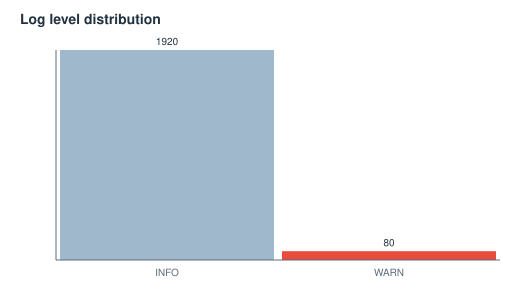
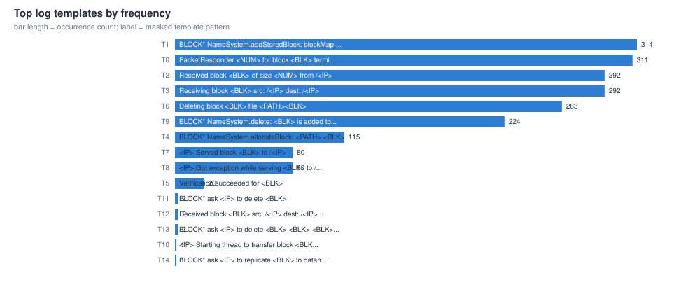
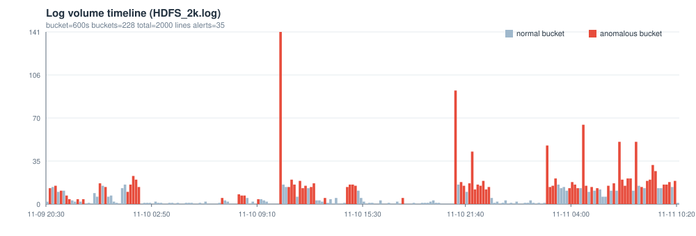

# HDFS_2k 日志解析与异常检测报告

> 自动生成于 2026-10-06 00:44:46 ｜ 工具 loglens v0.1.0 ｜ 数据文件 C:/Users/MorisKlaw/Desktop/dsh_work/loglens/data/HDFS_2k.log

## 0 结论速览

- **解析**：2000 行原始日志，结构化解析 2000 行，解析率 100.00%（自动识别格式 hdfs，编码 utf-8）
- **模板**：16 个模板（单例模板 3 个），时间桶宽 10min，共 228 个桶
- **异常**：检出 35 个异常窗口（high 5 / medium 14 / low 16），单点判定 215 条，各检测器：ewma=13, novelty=7, poisson=90, robust_z=97, rules=8
- **最值得先看**：窗口 11-10 10:30:00 ~ 10:30:00（约 10 分钟）；模板 T6 计数异常（观测 65 次 / 基线 0.87 次）；量级突变 volume-up；检测器 ewma+poisson+robust_z

## 1 数据概览

| 指标 | 值 | 指标 | 值 |
|---|---|---|---|
| 文件 | C:/Users/MorisKlaw/Desktop/dsh_work/loglens/data/HDFS_2k.log | 格式 | hdfs（匹配率 1.000） |
| 原始行数 | 2000 | 空行 | 0 |
| 解析记录 | 2000 | 兜底行 | 0 |
| 解析率 | 100.00% | 编码 | utf-8 |
| 时间范围 | 2008-11-09 20:36:15 ~ 2008-11-11 10:20:17 | 跨度 | 1.6d |
| 时间桶宽 | 10min | 桶数 | 228 |

### 1.1 级别与来源分布

**级别分布**

| 级别 | 条数 | 占比 |
|---|---|---|
| INFO | 1920 | 96.0% |
| WARN | 80 | 4.0% |

**来源 Top 10（logger / 进程）**

| 来源 | 条数 | 占比 |
|---|---|---|
| dfs.FSNamesystem | 659 | 33.0% |
| dfs.DataNode$PacketResponder | 603 | 30.1% |
| dfs.DataNode$DataXceiver | 454 | 22.7% |
| dfs.FSDataset | 263 | 13.2% |
| dfs.DataBlockScanner | 20 | 1.0% |
| dfs.DataNode | 1 | 0.1% |




## 2 模板挖掘（时间/级别/来源/事件形态）

解析层负责把时间、级别、来源抽成字段；模板层负责把正文里的变量（block id、IP、数字、路径…）掩码后聚类成有限个「事件形态」，这是后续所有统计检验的坐标系。

| 模板 | 形态（已掩码） | 次数 | 占比 | 首次出现 | 末次出现 | 主要级别 |
|---|---|---|---|---|---|---|
| T1 | [BLOCK* NameSystem.addStoredBlock: blockMap updated: <IP> is added to <BLK> size <NUM>] | 314 | 15.7% | 2008-11-09 20:40:05 | 2008-11-11 10:13:16 | INFO |
| T0 | [PacketResponder <NUM> for block <BLK> terminating] | 311 | 15.6% | 2008-11-09 20:36:15 | 2008-11-11 10:19:54 | INFO |
| T2 | [Received block <BLK> of size <NUM> from /<IP>] | 292 | 14.6% | 2008-11-09 20:46:55 | 2008-11-11 10:17:35 | INFO |
| T3 | [Receiving block <BLK> src: /<IP> dest: /<IP>] | 292 | 14.6% | 2008-11-09 20:48:15 | 2008-11-11 10:20:17 | INFO |
| T6 | [Deleting block <BLK> file <PATH><BLK>] | 263 | 13.2% | 2008-11-09 21:38:37 | 2008-11-11 10:02:10 | INFO |
| T9 | [BLOCK* NameSystem.delete: <BLK> is added to invalidSet of <IP>] | 224 | 11.2% | 2008-11-10 02:07:24 | 2008-11-11 08:59:29 | INFO |
| T4 | [BLOCK* NameSystem.allocateBlock: <PATH> <BLK>] | 115 | 5.8% | 2008-11-09 20:50:35 | 2008-11-11 10:12:25 | INFO |
| T7 | [<IP> Served block <BLK> to /<IP>] | 80 | 4.0% | 2008-11-09 21:38:47 | 2008-11-11 02:39:14 | INFO |
| T8 | [<IP>:Got exception while serving <BLK> to /<IP>:] | 80 | 4.0% | 2008-11-09 21:40:43 | 2008-11-11 01:44:31 | WARN |
| T5 | [Verification succeeded for <BLK>] | 20 | 1.0% | 2008-11-09 20:59:31 | 2008-11-11 09:37:42 | INFO |
| T11 | [BLOCK* ask <IP> to delete <BLK>] | 2 | 0.1% | 2008-11-10 21:25:10 | 2008-11-10 22:19:32 | INFO |
| T12 | [Received block <BLK> src: /<IP> dest: /<IP> of size <NUM>] | 2 | 0.1% | 2008-11-11 05:03:34 | 2008-11-11 08:10:55 | INFO |
| T13 | [BLOCK* ask <IP> to delete <BLK> <BLK> <BLK> <BLK> <BLK> <BLK> <BLK> <BLK> <BLK> <BLK> <...] | 2 | 0.1% | 2008-11-11 06:52:54 | 2008-11-11 06:53:03 | INFO |
| T10 | [<IP> Starting thread to transfer block <BLK> to <IP>] | 1 | 0.1% | 2008-11-10 21:15:41 | 2008-11-10 21:15:41 | INFO |
| T14 | [BLOCK* ask <IP> to replicate <BLK> to datanode(s) <IP>] | 1 | 0.1% | 2008-11-11 08:09:34 | 2008-11-11 08:09:34 | INFO |




## 3 异常检测结果

### 3.1 检测器与参数

| 检测器 | 方法 | 阈值/规则 |
|---|---|---|
| 稳健 z-score（模板计数） | MAD 估计 sigma | z >= 5.0，且计数 >= max(3, 中位数+3.0) |
| 泊松尾检验 | 上尾概率 + BH-FDR | p <= 0.01 粗筛，FDR q = 0.05，基线速率 >= 0.05 |
| EWMA 控制图 | 指数加权均值/方差 | lambda = 0.25，控制限 L = 4.0 |
| 新模板（novelty） | 观察期后首次出现 | 观察期 = 前 10% 时间桶 |
| 规则（关键词/级别） | 运维经验规则表 | 命中阈值按规则配置；权重上限 1.2 |
| 窗口融合 | 加权求和 | 桶分数 >= 1.0 判为异常桶，连续异常桶合并为事件 |

| 检测器 | 单点判定数 |
|---|---|
| robust_z | 97 |
| poisson | 90 |
| ewma | 13 |
| rules | 8 |
| novelty | 7 |

### 3.2 异常窗口（事件）列表

| 序号 | 开始 | 结束 | 时长 | 分数 | 严重度 | 检测器 | 涉及模板 | 摘要 |
|---|---|---|---|---|---|---|---|---|
| #1 | 2008-11-10 10:30:00 | 2008-11-10 10:30:00 | 10min | 3.60 | high | ewma,poisson,robust_z | T6,T9,T2 | 窗口 11-10 10:30:00 ~ 10:30:00（约 10 分钟）；模板 T6 计数异常（观测 65 次 / 基线 0.87 次）；量级突变 volume-up；检测器 ewma+poisson+robust_z |
| #2 | 2008-11-11 06:50:00 | 2008-11-11 07:30:00 | 50min | 3.20 | high | ewma,novelty,poisson,robust_z | T0,T1,T2,T6,T9 | 窗口 11-11 06:50:00 ~ 07:30:00（约 50 分钟）；模板 T6 计数异常（观测 22 次 / 基线 1.06 次）；出现 1 个观察期后的新模板；量级突变 volume-up；检测器 ewma+novelty+poisson+robust_z |
| #3 | 2008-11-09 21:40:00 | 2008-11-09 21:50:00 | 20min | 3.10 | high | ewma,poisson,rules | T8,T7 | 窗口 11-09 21:40:00 ~ 21:50:00（约 20 分钟）；模板 T8 计数异常（观测 4 次 / 基线 0.33 次）；规则命中 exception-traceback；量级突变 warn-volume-up；检测器 ewma+poisson+rules |
| #4 | 2008-11-10 01:20:00 | 2008-11-10 02:00:00 | 50min | 3.00 | high | novelty,poisson,robust_z | T0,T1,T4,T2,T9 | 窗口 11-10 01:20:00 ~ 02:00:00（约 50 分钟）；模板 T0 计数异常（观测 8 次 / 基线 1.33 次）；出现 1 个观察期后的新模板；检测器 novelty+poisson+robust_z |
| #5 | 2008-11-11 07:50:00 | 2008-11-11 07:50:00 | 10min | 3.00 | high | poisson,robust_z | T6,T9,T3,T0 | 窗口 11-11 07:50:00 ~ 07:50:00（约 10 分钟）；模板 T6 计数异常（观测 23 次 / 基线 1.06 次）；检测器 poisson+robust_z |
| #6 | 2008-11-11 08:30:00 | 2008-11-11 09:00:00 | 40min | 2.90 | medium | poisson,robust_z | T0,T1,T9,T6,T4 | 窗口 11-11 08:30:00 ~ 09:00:00（约 40 分钟）；模板 T9 计数异常（观测 21 次 / 基线 0.89 次）；检测器 poisson+robust_z |
| #7 | 2008-11-10 21:00:00 | 2008-11-10 21:00:00 | 10min | 2.60 | medium | ewma,poisson,robust_z | T6,T9 | 窗口 11-10 21:00:00 ~ 21:00:00（约 10 分钟）；模板 T6 计数异常（观测 49 次 / 基线 0.94 次）；量级突变 volume-up；检测器 ewma+poisson+robust_z |
| #8 | 2008-11-10 21:20:00 | 2008-11-10 21:30:00 | 20min | 2.60 | medium | novelty,poisson,robust_z | T0,T2,T3,T11 | 窗口 11-10 21:20:00 ~ 21:30:00（约 20 分钟）；模板 T2 计数异常（观测 5 次 / 基线 1.26 次）；出现 1 个观察期后的新模板；检测器 novelty+poisson+robust_z |
| #9 | 2008-11-11 02:30:00 | 2008-11-11 03:00:00 | 40min | 2.60 | medium | ewma,poisson,robust_z | T1,T6,T9,T0,T3 | 窗口 11-11 02:30:00 ~ 03:00:00（约 40 分钟）；模板 T6 计数异常（观测 22 次 / 基线 1.06 次）；量级突变 volume-up；检测器 ewma+poisson+robust_z |
| #10 | 2008-11-11 04:40:00 | 2008-11-11 04:50:00 | 20min | 2.60 | medium | ewma,poisson,robust_z | T6,T9,T1 | 窗口 11-11 04:40:00 ~ 04:50:00（约 20 分钟）；模板 T6 计数异常（观测 33 次 / 基线 1.01 次）；量级突变 volume-up；检测器 ewma+poisson+robust_z |
| #11 | 2008-11-10 08:00:00 | 2008-11-10 08:20:00 | 30min | 2.30 | medium | ewma,poisson,robust_z,rules | T7,T8 | 窗口 11-10 08:00:00 ~ 08:20:00（约 30 分钟）；模板 T7 计数异常（观测 6 次 / 基线 0.33 次）；规则命中 exception-traceback；量级突变 volume-up/warn-volume-up；检测器 ewma+poisson+robust_z+rules |
| #12 | 2008-11-10 12:20:00 | 2008-11-10 12:30:00 | 20min | 2.00 | medium | poisson,robust_z | T3,T0,T1 | 窗口 11-10 12:20:00 ~ 12:30:00（约 20 分钟）；模板 T3 计数异常（观测 6 次 / 基线 1.26 次）；检测器 poisson+robust_z |
| #13 | 2008-11-10 14:30:00 | 2008-11-10 15:00:00 | 40min | 2.00 | medium | poisson,robust_z | T3,T1,T2,T0 | 窗口 11-10 14:30:00 ~ 15:00:00（约 40 分钟）；模板 T1 计数异常（观测 8 次 / 基线 1.35 次）；检测器 poisson+robust_z |
| #14 | 2008-11-10 21:50:00 | 2008-11-10 23:00:00 | 1.3h | 2.00 | medium | poisson,robust_z | T2,T0,T3,T1,T9 | 窗口 11-10 21:50:00 ~ 23:00:00（约 1.3 小时）；模板 T9 计数异常（观测 19 次 / 基线 0.9 次）；检测器 poisson+robust_z |
| #15 | 2008-11-11 03:50:00 | 2008-11-11 04:20:00 | 40min | 2.00 | medium | poisson,robust_z | T0,T1,T3 | 窗口 11-11 03:50:00 ~ 04:20:00（约 40 分钟）；模板 T0 计数异常（观测 7 次 / 基线 1.34 次）；检测器 poisson+robust_z |
| #16 | 2008-11-11 09:30:00 | 2008-11-11 09:50:00 | 30min | 2.00 | medium | poisson,robust_z | T3,T0,T2,T1 | 窗口 11-11 09:30:00 ~ 09:50:00（约 30 分钟）；模板 T1 计数异常（观测 10 次 / 基线 1.34 次）；检测器 poisson+robust_z |
| #17 | 2008-11-11 06:30:00 | 2008-11-11 06:30:00 | 10min | 1.90 | medium | poisson,robust_z | T1,T4 | 窗口 11-11 06:30:00 ~ 06:30:00（约 10 分钟）；模板 T1 计数异常（观测 7 次 / 基线 1.35 次）；检测器 poisson+robust_z |
| #18 | 2008-11-10 17:50:00 | 2008-11-10 17:50:00 | 10min | 1.80 | medium | ewma,poisson | T8 | 窗口 11-10 17:50:00 ~ 17:50:00（约 10 分钟）；模板 T8 计数异常（观测 3 次 / 基线 0.34 次）；量级突变 warn-volume-up；检测器 ewma+poisson |
| #19 | 2008-11-10 07:00:00 | 2008-11-10 07:00:00 | 10min | 1.50 | medium | ewma,poisson | T7 | 窗口 11-10 07:00:00 ~ 07:00:00（约 10 分钟）；模板 T7 计数异常（观测 4 次 / 基线 0.33 次）；量级突变 volume-up；检测器 ewma+poisson |
| #20 | 2008-11-09 22:20:00 | 2008-11-09 22:20:00 | 10min | 1.30 | low | poisson,rules | T8 | 窗口 11-09 22:20:00 ~ 22:20:00（约 10 分钟）；模板 T8 计数异常（观测 4 次 / 基线 0.33 次）；规则命中 exception-traceback；检测器 poisson+rules |
| #21 | 2008-11-09 22:40:00 | 2008-11-09 22:40:00 | 10min | 1.30 | low | poisson,rules | T8 | 窗口 11-09 22:40:00 ~ 22:40:00（约 10 分钟）；模板 T8 计数异常（观测 4 次 / 基线 0.33 次）；规则命中 exception-traceback；检测器 poisson+rules |
| #22 | 2008-11-10 09:10:00 | 2008-11-10 09:10:00 | 10min | 1.30 | low | poisson,rules | T8 | 窗口 11-10 09:10:00 ~ 09:10:00（约 10 分钟）；模板 T8 计数异常（观测 3 次 / 基线 0.34 次）；规则命中 exception-traceback；检测器 poisson+rules |
| #23 | 2008-11-10 13:10:00 | 2008-11-10 13:10:00 | 10min | 1.30 | low | poisson,rules | T8 | 窗口 11-10 13:10:00 ~ 13:10:00（约 10 分钟）；模板 T8 计数异常（观测 4 次 / 基线 0.33 次）；规则命中 exception-traceback；检测器 poisson+rules |
| #24 | 2008-11-09 20:40:00 | 2008-11-09 20:40:00 | 10min | 1.00 | low | robust_z | T1 | 窗口 11-09 20:40:00 ~ 20:40:00（约 10 分钟）；模板 T1 计数异常（观测 5 次 / 基线 0.0 次）；检测器 robust_z |
| #25 | 2008-11-09 21:00:00 | 2008-11-09 21:00:00 | 10min | 1.00 | low | poisson,robust_z | T2 | 窗口 11-09 21:00:00 ~ 21:00:00（约 10 分钟）；模板 T2 计数异常（观测 8 次 / 基线 1.25 次）；检测器 poisson+robust_z |
| #26 | 2008-11-09 21:20:00 | 2008-11-09 21:20:00 | 10min | 1.00 | low | poisson,robust_z | T2 | 窗口 11-09 21:20:00 ~ 21:20:00（约 10 分钟）；模板 T2 计数异常（观测 5 次 / 基线 1.26 次）；检测器 poisson+robust_z |
| #27 | 2008-11-09 23:40:00 | 2008-11-09 23:40:00 | 10min | 1.00 | low | poisson,robust_z | T0 | 窗口 11-09 23:40:00 ~ 23:40:00（约 10 分钟）；模板 T0 计数异常（观测 6 次 / 基线 1.34 次）；检测器 poisson+robust_z |
| #28 | 2008-11-10 00:00:00 | 2008-11-10 00:00:00 | 10min | 1.00 | low | robust_z | T0 | 窗口 11-10 00:00:00 ~ 00:00:00（约 10 分钟）；模板 T0 计数异常（观测 5 次 / 基线 0.0 次）；检测器 robust_z |
| #29 | 2008-11-10 11:00:00 | 2008-11-10 11:20:00 | 30min | 1.00 | low | poisson,robust_z | T2,T1,T3 | 窗口 11-10 11:00:00 ~ 11:20:00（约 30 分钟）；模板 T1 计数异常（观测 7 次 / 基线 1.35 次）；检测器 poisson+robust_z |
| #30 | 2008-11-10 11:40:00 | 2008-11-10 12:00:00 | 30min | 1.00 | low | poisson,robust_z | T3,T1 | 窗口 11-10 11:40:00 ~ 12:00:00（约 30 分钟）；模板 T3 计数异常（观测 8 次 / 基线 1.25 次）；检测器 poisson+robust_z |
| #31 | 2008-11-11 05:10:00 | 2008-11-11 05:10:00 | 10min | 1.00 | low | robust_z | T1 | 窗口 11-11 05:10:00 ~ 05:10:00（约 10 分钟）；模板 T1 计数异常（观测 5 次 / 基线 0.0 次）；检测器 robust_z |
| #32 | 2008-11-11 05:30:00 | 2008-11-11 05:30:00 | 10min | 1.00 | low | poisson,robust_z | T3 | 窗口 11-11 05:30:00 ~ 05:30:00（约 10 分钟）；模板 T3 计数异常（观测 5 次 / 基线 1.26 次）；检测器 poisson+robust_z |
| #33 | 2008-11-11 06:10:00 | 2008-11-11 06:10:00 | 10min | 1.00 | low | poisson,robust_z | T2 | 窗口 11-11 06:10:00 ~ 06:10:00（约 10 分钟）；模板 T2 计数异常（观测 7 次 / 基线 1.26 次）；检测器 poisson+robust_z |
| #34 | 2008-11-11 08:10:00 | 2008-11-11 08:10:00 | 10min | 1.00 | low | poisson,robust_z | T2 | 窗口 11-11 08:10:00 ~ 08:10:00（约 10 分钟）；模板 T2 计数异常（观测 5 次 / 基线 1.26 次）；检测器 poisson+robust_z |
| #35 | 2008-11-11 10:10:00 | 2008-11-11 10:10:00 | 10min | 1.00 | low | poisson,robust_z | T0 | 窗口 11-11 10:10:00 ~ 10:10:00（约 10 分钟）；模板 T0 计数异常（观测 7 次 / 基线 1.34 次）；检测器 poisson+robust_z |




### 3.3 重点异常窗口证据

#### 事件 #1 ｜ 2008-11-10 10:30:00 ~ 2008-11-10 10:30:00 ｜ 分数 3.60 ｜ high

**摘要**：窗口 11-10 10:30:00 ~ 10:30:00（约 10 分钟）；模板 T6 计数异常（观测 65 次 / 基线 0.87 次）；量级突变 volume-up；检测器 ewma+poisson+robust_z

**判断依据**

- 模板 T6 在本桶出现 65 次，历史中位数 0.0 次，稳健 z = 65.0（阈值 5.0，sigma=1.0）
- 模板 T9 在本桶出现 64 次，历史中位数 0.0 次，稳健 z = 64.0（阈值 5.0，sigma=1.0）
- 模板 T6 本桶 65 次，基线速率 0.872 次/桶（放大 74.5 倍），泊松上尾 p = 1.11e-16，在 284 次检验中经 BH-FDR(q=0.05) 校正后仍显著
- 模板 T9 本桶 64 次，基线速率 0.705 次/桶（放大 90.8 倍），泊松上尾 p = 0.00e+00，在 284 次检验中经 BH-FDR(q=0.05) 校正后仍显著
- 模板 T2 本桶 5 次，基线速率 1.264 次/桶（放大 4.0 倍），泊松上尾 p = 9.55e-03，在 284 次检验中经 BH-FDR(q=0.05) 校正后仍显著
- 模板 T2 在本桶出现 5 次，历史中位数 0.0 次，稳健 z = 5.0（阈值 5.0，sigma=1.0）
- volume 本桶 141 条，历史中位数 4.0 条，偏离控制限 74.4 sigma（L=4.0，方向 上升）

**涉及模板**

- T6：Deleting block <BLK> file <PATH><BLK>
- T9：BLOCK* NameSystem.delete: <BLK> is added to invalidSet of <IP>
- T2：Received block <BLK> of size <NUM> from /<IP>

**原始日志证据（可回溯到行号）**

```text
L426 | 2008-11-10 10:32:01 | 081110 103201 19 INFO dfs.FSDataset: Deleting block blk_8483848473254499625 file /mnt/hadoop/dfs/data/current/subdir51/blk_8483848473254499625
L428 | 2008-11-10 10:32:57 | 081110 103257 19 INFO dfs.FSDataset: Deleting block blk_-8898274302731129139 file /mnt/hadoop/dfs/data/current/subdir18/blk_-8898274302731129139
L429 | 2008-11-10 10:33:20 | 081110 103320 18 INFO dfs.FSDataset: Deleting block blk_-8014701913801168461 file /mnt/hadoop/dfs/data/current/subdir27/blk_-8014701913801168461
L362 | 2008-11-10 10:30:26 | 081110 103026 34 INFO dfs.FSNamesystem: BLOCK* NameSystem.delete: blk_-1233005817943453613 is added to invalidSet of 10.251.75.49:50010
L363 | 2008-11-10 10:30:26 | 081110 103026 34 INFO dfs.FSNamesystem: BLOCK* NameSystem.delete: blk_-8736461628840265232 is added to invalidSet of 10.251.195.70:50010
L364 | 2008-11-10 10:30:27 | 081110 103027 34 INFO dfs.FSNamesystem: BLOCK* NameSystem.delete: blk_166171721314010075 is added to invalidSet of 10.251.30.85:50010
```

#### 事件 #2 ｜ 2008-11-11 06:50:00 ~ 2008-11-11 07:30:00 ｜ 分数 3.20 ｜ high

**摘要**：窗口 11-11 06:50:00 ~ 07:30:00（约 50 分钟）；模板 T6 计数异常（观测 22 次 / 基线 1.06 次）；出现 1 个观察期后的新模板；量级突变 volume-up；检测器 ewma+novelty+poisson+robust_z

**判断依据**

- 模板 T6 本桶 22 次，基线速率 1.062 次/桶（放大 20.7 倍），泊松上尾 p = 0.00e+00，在 284 次检验中经 BH-FDR(q=0.05) 校正后仍显著
- 模板 T9 本桶 17 次，基线速率 0.912 次/桶（放大 18.6 倍），泊松上尾 p = 1.11e-16，在 284 次检验中经 BH-FDR(q=0.05) 校正后仍显著
- 模板 T6 在本桶出现 22 次，历史中位数 0.0 次，稳健 z = 22.0（阈值 5.0，sigma=1.0）
- 模板 T9 在本桶出现 17 次，历史中位数 0.0 次，稳健 z = 17.0（阈值 5.0，sigma=1.0）
- 模板 T2 本桶 8 次，基线速率 1.251 次/桶（放大 6.4 倍），泊松上尾 p = 4.94e-05，在 284 次检验中经 BH-FDR(q=0.05) 校正后仍显著
- 模板 T0 本桶 8 次，基线速率 1.335 次/桶（放大 6.0 倍），泊松上尾 p = 7.70e-05，在 284 次检验中经 BH-FDR(q=0.05) 校正后仍显著
- 模板 T1 本桶 7 次，基线速率 1.352 次/桶（放大 5.2 倍），泊松上尾 p = 5.09e-04，在 284 次检验中经 BH-FDR(q=0.05) 校正后仍显著
- 模板 T0 本桶 6 次，基线速率 1.344 次/桶（放大 4.5 倍），泊松上尾 p = 2.62e-03，在 284 次检验中经 BH-FDR(q=0.05) 校正后仍显著
- 模板 T2 本桶 5 次，基线速率 1.264 次/桶（放大 4.0 倍），泊松上尾 p = 9.55e-03，在 284 次检验中经 BH-FDR(q=0.05) 校正后仍显著
- 模板 T0 在本桶出现 8 次，历史中位数 0.0 次，稳健 z = 8.0（阈值 5.0，sigma=1.0）
- 模板 T2 在本桶出现 8 次，历史中位数 0.0 次，稳健 z = 8.0（阈值 5.0，sigma=1.0）
- 模板 T1 在本桶出现 7 次，历史中位数 0.0 次，稳健 z = 7.0（阈值 5.0，sigma=1.0）

**涉及模板**

- T0：PacketResponder <NUM> for block <BLK> terminating
- T1：BLOCK* NameSystem.addStoredBlock: blockMap updated: <IP> is added to <BLK> size <NUM>
- T2：Received block <BLK> of size <NUM> from /<IP>
- T6：Deleting block <BLK> file <PATH><BLK>
- T9：BLOCK* NameSystem.delete: <BLK> is added to invalidSet of <IP>

**原始日志证据（可回溯到行号）**

```text
L1578 | 2008-11-11 06:52:29 | 081111 065229 19 INFO dfs.FSDataset: Deleting block blk_-7423574498760490375 file /mnt/hadoop/dfs/data/current/subdir58/blk_-7423574498760490375
L1580 | 2008-11-11 06:52:58 | 081111 065258 19 INFO dfs.FSDataset: Deleting block blk_-9169228974826183399 file /mnt/hadoop/dfs/data/current/subdir5/blk_-9169228974826183399
L1584 | 2008-11-11 06:54:18 | 081111 065418 18 INFO dfs.FSDataset: Deleting block blk_-1306900105984505600 file /mnt/hadoop/dfs/data/current/subdir31/blk_-1306900105984505600
L1561 | 2008-11-11 06:52:05 | 081111 065205 26 INFO dfs.FSNamesystem: BLOCK* NameSystem.delete: blk_-4438918035940270891 is added to invalidSet of 10.251.71.193:50010
L1562 | 2008-11-11 06:52:05 | 081111 065205 26 INFO dfs.FSNamesystem: BLOCK* NameSystem.delete: blk_5616920288053661280 is added to invalidSet of 10.251.42.9:50010
L1563 | 2008-11-11 06:52:06 | 081111 065206 26 INFO dfs.FSNamesystem: BLOCK* NameSystem.delete: blk_1815340037591016775 is added to invalidSet of 10.250.9.207:50010
```

#### 事件 #3 ｜ 2008-11-09 21:40:00 ~ 2008-11-09 21:50:00 ｜ 分数 3.10 ｜ high

**摘要**：窗口 11-09 21:40:00 ~ 21:50:00（约 20 分钟）；模板 T8 计数异常（观测 4 次 / 基线 0.33 次）；规则命中 exception-traceback；量级突变 warn-volume-up；检测器 ewma+poisson+rules

**判断依据**

- 模板 T8 本桶 4 次，基线速率 0.335 次/桶（放大 11.9 倍），泊松上尾 p = 4.01e-04，在 284 次检验中经 BH-FDR(q=0.05) 校正后仍显著
- 模板 T7 本桶 3 次，基线速率 0.339 次/桶（放大 8.8 倍），泊松上尾 p = 5.05e-03，在 284 次检验中经 BH-FDR(q=0.05) 校正后仍显著
- 模板 T8 本桶 3 次，基线速率 0.339 次/桶（放大 8.8 倍），泊松上尾 p = 5.05e-03，在 284 次检验中经 BH-FDR(q=0.05) 校正后仍显著
- warn-volume 本桶 4 条，历史中位数 0.0 条，偏离控制限 12.1 sigma（L=4.0，方向 上升）
- 异常/堆栈：通常是故障的直接现场；本桶命中 4 次（规则阈值 2 次，全文共 80 次）
- 异常/堆栈：通常是故障的直接现场；本桶命中 3 次（规则阈值 2 次，全文共 80 次）

**涉及模板**

- T8：<IP>:Got exception while serving <BLK> to /<IP>:
- T7：<IP> Served block <BLK> to /<IP>

**原始日志证据（可回溯到行号）**

```text
L78 | 2008-11-09 21:40:43 | 081109 214043 2561 WARN dfs.DataNode$DataXceiver: 10.251.30.85:50010:Got exception while serving blk_-2918118818249673980 to /10.251.90.64:
L79 | 2008-11-09 21:44:02 | 081109 214402 2677 WARN dfs.DataNode$DataXceiver: 10.251.126.255:50010:Got exception while serving blk_8376667364205250596 to /10.251.91.159:
L81 | 2008-11-09 21:45:29 | 081109 214529 2747 WARN dfs.DataNode$DataXceiver: 10.251.123.132:50010:Got exception while serving blk_3763728533434719668 to /10.251.38.214:
L77 | 2008-11-09 21:40:09 | 081109 214009 2594 INFO dfs.DataNode$DataXceiver: 10.250.5.237:50010 Served block blk_3166960787499091856 to /10.251.43.147
L80 | 2008-11-09 21:45:24 | 081109 214524 2633 INFO dfs.DataNode$DataXceiver: 10.251.71.68:50010 Served block blk_-2794533871450434534 to /10.251.199.150
L83 | 2008-11-09 21:49:19 | 081109 214919 2899 INFO dfs.DataNode$DataXceiver: 10.251.214.32:50010 Served block blk_-6520030462660619051 to /10.251.215.70
```

#### 事件 #4 ｜ 2008-11-10 01:20:00 ~ 2008-11-10 02:00:00 ｜ 分数 3.00 ｜ high

**摘要**：窗口 11-10 01:20:00 ~ 02:00:00（约 50 分钟）；模板 T0 计数异常（观测 8 次 / 基线 1.33 次）；出现 1 个观察期后的新模板；检测器 novelty+poisson+robust_z

**判断依据**

- 模板 T0 本桶 8 次，基线速率 1.335 次/桶（放大 6.0 倍），泊松上尾 p = 7.70e-05，在 284 次检验中经 BH-FDR(q=0.05) 校正后仍显著
- 模板 T4 本桶 5 次，基线速率 0.485 次/桶（放大 10.3 倍），泊松上尾 p = 1.49e-04，在 284 次检验中经 BH-FDR(q=0.05) 校正后仍显著
- 模板 T4 本桶 5 次，基线速率 0.485 次/桶（放大 10.3 倍），泊松上尾 p = 1.49e-04，在 284 次检验中经 BH-FDR(q=0.05) 校正后仍显著
- 模板 T1 本桶 6 次，基线速率 1.357 次/桶（放大 4.4 倍），泊松上尾 p = 2.75e-03，在 284 次检验中经 BH-FDR(q=0.05) 校正后仍显著
- 模板 T2 本桶 5 次，基线速率 1.264 次/桶（放大 4.0 倍），泊松上尾 p = 9.55e-03，在 284 次检验中经 BH-FDR(q=0.05) 校正后仍显著
- 模板 T0 在本桶出现 8 次，历史中位数 0.0 次，稳健 z = 8.0（阈值 5.0，sigma=1.0）
- 模板 T1 在本桶出现 6 次，历史中位数 0.0 次，稳健 z = 6.0（阈值 5.0，sigma=1.0）
- 模板 T0 在本桶出现 5 次，历史中位数 0.0 次，稳健 z = 5.0（阈值 5.0，sigma=1.0）
- 模板 T2 在本桶出现 5 次，历史中位数 0.0 次，稳健 z = 5.0（阈值 5.0，sigma=1.0）
- 模板 T4 在本桶出现 5 次，历史中位数 0.0 次，稳健 z = 5.0（阈值 5.0，sigma=1.0）
- 模板 T0 在本桶出现 5 次，历史中位数 0.0 次，稳健 z = 5.0（阈值 5.0，sigma=1.0）
- 模板 T1 在本桶出现 5 次，历史中位数 0.0 次，稳健 z = 5.0（阈值 5.0，sigma=1.0）

**涉及模板**

- T0：PacketResponder <NUM> for block <BLK> terminating
- T1：BLOCK* NameSystem.addStoredBlock: blockMap updated: <IP> is added to <BLK> size <NUM>
- T4：BLOCK* NameSystem.allocateBlock: <PATH> <BLK>
- T2：Received block <BLK> of size <NUM> from /<IP>
- T9：BLOCK* NameSystem.delete: <BLK> is added to invalidSet of <IP>

**原始日志证据（可回溯到行号）**

```text
L237 | 2008-11-10 01:40:23 | 081110 014023 5733 INFO dfs.DataNode$PacketResponder: PacketResponder 0 for block blk_4741107979793372752 terminating
L241 | 2008-11-10 01:41:38 | 081110 014138 5832 INFO dfs.DataNode$PacketResponder: PacketResponder 1 for block blk_-3802183646922512795 terminating
L244 | 2008-11-10 01:42:57 | 081110 014257 5803 INFO dfs.DataNode$PacketResponder: PacketResponder 1 for block blk_1997668456720275587 terminating
L243 | 2008-11-10 01:42:07 | 081110 014207 27 INFO dfs.FSNamesystem: BLOCK* NameSystem.allocateBlock: /user/root/randtxt/_temporary/_task_200811092030_0003_m_001365_0/part-01365. blk_4841101867353115844
L250 | 2008-11-10 01:45:19 | 081110 014519 32 INFO dfs.FSNamesystem: BLOCK* NameSystem.allocateBlock: /user/root/randtxt/_temporary/_task_200811092030_0003_m_001506_0/part-01506. blk_1104376461837247304
L253 | 2008-11-10 01:47:27 | 081110 014727 29 INFO dfs.FSNamesystem: BLOCK* NameSystem.allocateBlock: /user/root/randtxt/_temporary/_task_200811092030_0003_m_001597_0/part-01597. blk_-591552904934794824
```

#### 事件 #5 ｜ 2008-11-11 07:50:00 ~ 2008-11-11 07:50:00 ｜ 分数 3.00 ｜ high

**摘要**：窗口 11-11 07:50:00 ~ 07:50:00（约 10 分钟）；模板 T6 计数异常（观测 23 次 / 基线 1.06 次）；检测器 poisson+robust_z

**判断依据**

- 模板 T6 本桶 23 次，基线速率 1.057 次/桶（放大 21.8 倍），泊松上尾 p = 0.00e+00，在 284 次检验中经 BH-FDR(q=0.05) 校正后仍显著
- 模板 T9 本桶 13 次，基线速率 0.93 次/桶（放大 14.0 倍），泊松上尾 p = 2.62e-11，在 284 次检验中经 BH-FDR(q=0.05) 校正后仍显著
- 模板 T6 在本桶出现 23 次，历史中位数 0.0 次，稳健 z = 23.0（阈值 5.0，sigma=1.0）
- 模板 T9 在本桶出现 13 次，历史中位数 0.0 次，稳健 z = 13.0（阈值 5.0，sigma=1.0）
- 模板 T3 本桶 5 次，基线速率 1.264 次/桶（放大 4.0 倍），泊松上尾 p = 9.55e-03，在 284 次检验中经 BH-FDR(q=0.05) 校正后仍显著
- 模板 T0 在本桶出现 5 次，历史中位数 0.0 次，稳健 z = 5.0（阈值 5.0，sigma=1.0）
- 模板 T3 在本桶出现 5 次，历史中位数 0.0 次，稳健 z = 5.0（阈值 5.0，sigma=1.0）

**涉及模板**

- T6：Deleting block <BLK> file <PATH><BLK>
- T9：BLOCK* NameSystem.delete: <BLK> is added to invalidSet of <IP>
- T3：Receiving block <BLK> src: /<IP> dest: /<IP>
- T0：PacketResponder <NUM> for block <BLK> terminating

**原始日志证据（可回溯到行号）**

```text
L1724 | 2008-11-11 07:57:27 | 081111 075727 19 INFO dfs.FSDataset: Deleting block blk_6888300867578983331 file /mnt/hadoop/dfs/data/current/subdir46/blk_6888300867578983331
L1726 | 2008-11-11 07:57:46 | 081111 075746 19 INFO dfs.FSDataset: Deleting block blk_-8443921001690182522 file /mnt/hadoop/dfs/data/current/subdir33/blk_-8443921001690182522
L1728 | 2008-11-11 07:57:53 | 081111 075753 19 INFO dfs.FSDataset: Deleting block blk_-7446091384471755694 file /mnt/hadoop/dfs/data/current/subdir30/blk_-7446091384471755694
L1710 | 2008-11-11 07:56:16 | 081111 075616 28 INFO dfs.FSNamesystem: BLOCK* NameSystem.delete: blk_4471044334742081825 is added to invalidSet of 10.250.15.198:50010
L1711 | 2008-11-11 07:56:19 | 081111 075619 28 INFO dfs.FSNamesystem: BLOCK* NameSystem.delete: blk_-3671953658029337449 is added to invalidSet of 10.250.14.143:50010
L1712 | 2008-11-11 07:56:23 | 081111 075623 28 INFO dfs.FSNamesystem: BLOCK* NameSystem.delete: blk_-75893538967225087 is added to invalidSet of 10.250.15.198:50010
```

## 4 方法选择与局限（漏报 / 误报）

本项目采用「模板挖掘 + 统计检验」为主线、关键词规则为补充的混合方案：无需标注数据、每个判定都能给出统计量与原始日志证据、只依赖 numpy/pandas，适合 5~8 人小团队快速落地。方法与选型理由见 docs/01-method-research.md。

**已知漏报场景**：① 日志格式或模板发生演化（同一事件被掩码/分词成新模板）；② 异常以少量单条形式出现（计数未达到 min_observed 与 z 阈值）；③ 静默失败（系统直接挂掉、日志中断，错误行根本没写出来）；④ 规则表未覆盖的故障语义；⑤ 时间桶过宽把突发摊平。

**已知误报场景**：① 正常业务突增（促销、批处理窗口、集群扩容）；② 重启/版本升级带来大批新模板；③ 上游依赖抖动导致的连锁重试；④ 日志轮转或采样策略变化引起的量级跳变；⑤ 规则表过宽的关键词（例如把普通包含 error 字样的行判为错误）。

完整的失效模式、量化评测与缓解手段见 docs/03-false-alarm-analysis.md。

## 5 复现命令

```bash
python -m loglens run -i data/HDFS_2k.log -o results/HDFS --format hdfs
```
