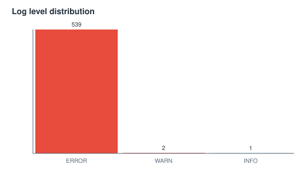
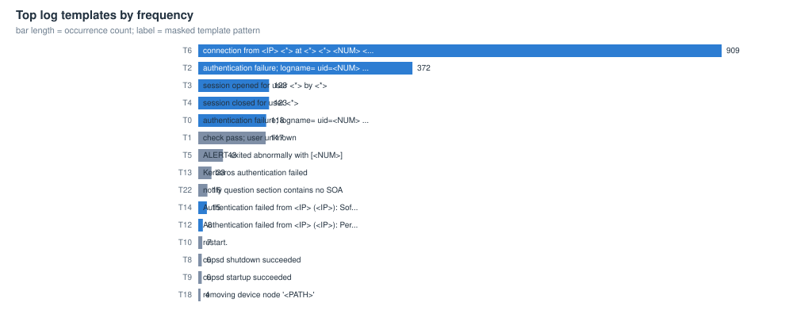
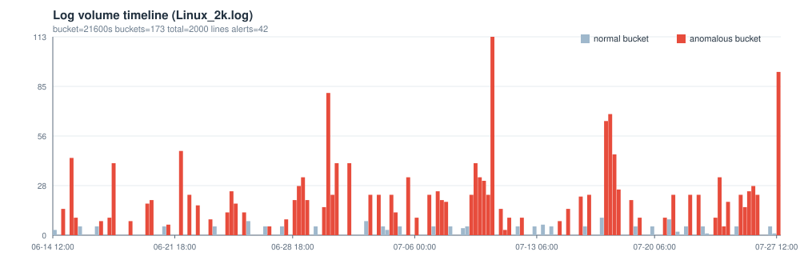

# Linux_2k 日志解析与异常检测报告

> 自动生成于 2026-10-06 00:44:47 ｜ 工具 loglens v0.1.0 ｜ 数据文件 C:/Users/MorisKlaw/Desktop/dsh_work/loglens/data/Linux_2k.log

## 0 结论速览

- **解析**：2000 行原始日志，结构化解析 2000 行，解析率 100.00%（自动识别格式 linux，编码 utf-8）
- **模板**：115 个模板（单例模板 94 个），时间桶宽 6h，共 173 个桶
- **异常**：检出 42 个异常窗口（high 14 / medium 17 / low 11），单点判定 381 条，各检测器：ewma=15, novelty=107, poisson=94, robust_z=101, rules=64
- **最值得先看**：窗口 06-30 12:00:00 ~ 06:00:00（约 1.0 天）；模板 T3 计数异常（观测 10 次 / 基线 0.66 次）；出现 3 个观察期后的新模板；规则命中 auth-failure/error-level/unknown-user；量级突变 error-volume-up/volume-up；检测器 ewma+novelty+poisson+robust_z+rules

## 1 数据概览

| 指标 | 值 | 指标 | 值 |
|---|---|---|---|
| 文件 | C:/Users/MorisKlaw/Desktop/dsh_work/loglens/data/Linux_2k.log | 格式 | linux（匹配率 1.000） |
| 原始行数 | 2000 | 空行 | 0 |
| 解析记录 | 2000 | 兜底行 | 0 |
| 解析率 | 100.00% | 编码 | utf-8 |
| 时间范围 | 2005-06-14 15:16:01 ~ 2005-07-27 14:42:00 | 跨度 | 43.0d |
| 时间桶宽 | 6h | 桶数 | 173 |

### 1.1 级别与来源分布

**级别分布**

| 级别 | 条数 | 占比 |
|---|---|---|
| ERROR | 539 | 99.4% |
| WARN | 2 | 0.4% |
| INFO | 1 | 0.2% |

**来源 Top 10（logger / 进程）**

| 来源 | 条数 | 占比 |
|---|---|---|
| ftpd | 916 | 45.8% |
| sshd(pam_unix) | 677 | 33.9% |
| su(pam_unix) | 172 | 8.6% |
| kernel | 76 | 3.8% |
| klogind | 46 | 2.3% |
| logrotate | 43 | 2.1% |
| named | 16 | 0.8% |
| cups | 12 | 0.6% |
| udev | 8 | 0.4% |
| syslogd | 7 | 0.3% |




## 2 模板挖掘（时间/级别/来源/事件形态）

解析层负责把时间、级别、来源抽成字段；模板层负责把正文里的变量（block id、IP、数字、路径…）掩码后聚类成有限个「事件形态」，这是后续所有统计检验的坐标系。

| 模板 | 形态（已掩码） | 次数 | 占比 | 首次出现 | 末次出现 | 主要级别 |
|---|---|---|---|---|---|---|
| T6 | [connection from <IP> <*> at <*> <*> <NUM> <NUM>:<NUM>:<NUM> <NUM>] | 909 | 45.5% | 2005-06-17 07:07:00 | 2005-07-27 10:59:53 | - |
| T2 | [authentication failure; logname= uid=<NUM> euid=<NUM> tty=NODEVssh ruser= <*> <*>] | 372 | 18.6% | 2005-06-15 02:04:59 | 2005-07-26 07:04:12 | ERROR |
| T3 | [session opened for user <*> by <*>] | 123 | 6.2% | 2005-06-15 04:06:18 | 2005-07-27 04:21:39 | - |
| T4 | [session closed for user <*>] | 123 | 6.2% | 2005-06-15 04:06:19 | 2005-07-27 04:21:40 | - |
| T0 | [authentication failure; logname= uid=<NUM> euid=<NUM> <*> ruser= <*>] | 118 | 5.9% | 2005-06-14 15:16:01 | 2005-07-20 23:37:46 | ERROR |
| T1 | [check pass; user unknown] | 117 | 5.8% | 2005-06-14 15:16:02 | 2005-07-20 23:37:46 | - |
| T5 | [ALERT exited abnormally with [<NUM>]] | 43 | 2.1% | 2005-06-15 04:06:20 | 2005-07-27 04:16:09 | - |
| T13 | [Kerberos authentication failed] | 23 | 1.1% | 2005-06-30 20:53:04 | 2005-06-30 20:53:06 | ERROR |
| T22 | [notify question section contains no SOA] | 16 | 0.8% | 2005-07-25 12:09:06 | 2005-07-25 16:29:20 | - |
| T14 | [Authentication failed from <IP> (<IP>): Software caused connection abort] | 15 | 0.8% | 2005-06-30 20:53:04 | 2005-06-30 20:53:06 | ERROR |
| T12 | [Authentication failed from <IP> (<IP>): Permission denied in replay cache code] | 8 | 0.4% | 2005-06-30 20:53:04 | 2005-06-30 20:53:04 | ERROR |
| T10 | [restart.] | 7 | 0.3% | 2005-06-19 04:09:11 | 2005-07-27 14:41:57 | - |
| T8 | [cupsd shutdown succeeded] | 6 | 0.3% | 2005-06-19 04:08:57 | 2005-07-24 04:20:21 | - |
| T9 | [cupsd startup succeeded] | 6 | 0.3% | 2005-06-19 04:09:02 | 2005-07-24 04:20:26 | - |
| T18 | [removing device node '<PATH>'] | 4 | 0.2% | 2005-07-07 08:09:11 | 2005-07-07 08:09:11 | - |




## 3 异常检测结果

### 3.1 检测器与参数

| 检测器 | 方法 | 阈值/规则 |
|---|---|---|
| 稳健 z-score（模板计数） | MAD 估计 sigma | z >= 5.0，且计数 >= max(3, 中位数+3.0) |
| 泊松尾检验 | 上尾概率 + BH-FDR | p <= 0.01 粗筛，FDR q = 0.05，基线速率 >= 0.05 |
| EWMA 控制图 | 指数加权均值/方差 | lambda = 0.25，控制限 L = 4.0 |
| 新模板（novelty） | 观察期后首次出现 | 观察期 = 前 10% 时间桶 |
| 规则（关键词/级别） | 运维经验规则表 | 命中阈值按规则配置；权重上限 1.2 |
| 窗口融合 | 加权求和 | 桶分数 >= 1.0 判为异常桶，连续异常桶合并为事件 |

| 检测器 | 单点判定数 |
|---|---|
| novelty | 107 |
| robust_z | 101 |
| poisson | 94 |
| rules | 64 |
| ewma | 15 |

### 3.2 异常窗口（事件）列表

| 序号 | 开始 | 结束 | 时长 | 分数 | 严重度 | 检测器 | 涉及模板 | 摘要 |
|---|---|---|---|---|---|---|---|---|
| #1 | 2005-06-30 12:00:00 | 2005-07-01 06:00:00 | 1d | 8.70 | high | ewma,novelty,poisson,robust_z,rules | T2,T3,T4,T13,T14 | 窗口 06-30 12:00:00 ~ 06:00:00（约 1.0 天）；模板 T3 计数异常（观测 10 次 / 基线 0.66 次）；出现 3 个观察期后的新模板；规则命中 auth-failure/error-level/unknown-user；量级突变 error-volume-up/volume-u... |
| #2 | 2005-06-22 00:00:00 | 2005-06-22 00:00:00 | 6h | 5.70 | high | ewma,poisson,robust_z,rules | T2,T1,T0 | 窗口 06-22 00:00:00 ~ 00:00:00（约 6.0 小时）；模板 T2 计数异常（观测 23 次 / 基线 2.03 次）；规则命中 auth-failure/error-level/unknown-user；量级突变 error-volume-up/volume-up；检测器 ewma+poi... |
| #3 | 2005-07-07 06:00:00 | 2005-07-07 18:00:00 | 18h | 5.00 | high | novelty,poisson,robust_z,rules | T6,T3,T4,T1,T0 | 窗口 07-07 06:00:00 ~ 18:00:00（约 18.0 小时）；模板 T6 计数异常（观测 19 次 / 基线 5.17 次）；出现 5 个观察期后的新模板；规则命中 error-level；检测器 novelty+poisson+robust_z+rules |
| #4 | 2005-06-17 18:00:00 | 2005-06-18 00:00:00 | 12h | 4.80 | high | ewma,poisson,robust_z,rules | T6,T1,T0 | 窗口 06-17 18:00:00 ~ 00:00:00（约 12.0 小时）；模板 T1 计数异常（观测 10 次 / 基线 0.62 次）；规则命中 error-level/unknown-user；量级突变 volume-up；检测器 ewma+poisson+robust_z+rules |
| #5 | 2005-07-09 06:00:00 | 2005-07-10 12:00:00 | 1.5d | 4.70 | high | ewma,poisson,robust_z,rules | T6,T2 | 窗口 07-09 06:00:00 ~ 12:00:00（约 1.5 天）；模板 T6 计数异常（观测 41 次 / 基线 5.05 次）；规则命中 auth-failure/error-level；量级突变 error-volume-up/volume-up；检测器 ewma+poisson+robust_z+... |
| #6 | 2005-07-27 12:00:00 | 2005-07-27 12:00:00 | 6h | 4.40 | high | ewma,novelty,rules | T62,T63,T76,T25,T26 | 窗口 07-27 12:00:00 ~ 12:00:00（约 6.0 小时）；出现 90 个观察期后的新模板；规则命中 error-level；量级突变 volume-up；检测器 ewma+novelty+rules |
| #7 | 2005-06-28 18:00:00 | 2005-06-29 12:00:00 | 1d | 4.20 | high | poisson,robust_z,rules | T2,T6,T1,T0 | 窗口 06-28 18:00:00 ~ 12:00:00（约 1.0 天）；模板 T6 计数异常（观测 23 次 / 基线 5.15 次）；规则命中 auth-failure/error-level；检测器 poisson+robust_z+rules |
| #8 | 2005-07-02 00:00:00 | 2005-07-02 00:00:00 | 6h | 4.20 | high | poisson,robust_z,rules | T1,T0,T3,T4 | 窗口 07-02 00:00:00 ~ 00:00:00（约 6.0 小时）；模板 T1 计数异常（观测 10 次 / 基线 0.62 次）；规则命中 error-level/unknown-user；检测器 poisson+robust_z+rules |
| #9 | 2005-06-20 00:00:00 | 2005-06-20 06:00:00 | 12h | 4.10 | high | ewma,novelty,poisson,robust_z,rules | T6,T1,T0,T11 | 窗口 06-20 00:00:00 ~ 06:00:00（约 12.0 小时）；模板 T1 计数异常（观测 10 次 / 基线 0.62 次）；出现 1 个观察期后的新模板；规则命中 error-level/unknown-user；量级突变 error-volume-up；检测器 ewma+novelty+po... |
| #10 | 2005-07-18 18:00:00 | 2005-07-18 18:00:00 | 6h | 4.10 | high | ewma,poisson,robust_z,rules | T1,T0 | 窗口 07-18 18:00:00 ~ 18:00:00（约 6.0 小时）；模板 T1 计数异常（观测 10 次 / 基线 0.62 次）；规则命中 error-level/unknown-user；量级突变 error-volume-up；检测器 ewma+poisson+robust_z+rules |
| #11 | 2005-06-15 12:00:00 | 2005-06-15 18:00:00 | 12h | 3.80 | high | ewma,poisson,robust_z,rules | T0,T1 | 窗口 06-15 12:00:00 ~ 18:00:00（约 12.0 小时）；模板 T0 计数异常（观测 22 次 / 基线 0.56 次）；规则命中 auth-failure/error-level/unknown-user；量级突变 volume-up；检测器 ewma+poisson+robust_z+r... |
| #12 | 2005-07-05 12:00:00 | 2005-07-05 12:00:00 | 6h | 3.80 | high | poisson,robust_z,rules | T6,T1,T0 | 窗口 07-05 12:00:00 ~ 12:00:00（约 6.0 小时）；模板 T6 计数异常（观测 23 次 / 基线 5.15 次）；规则命中 error-level；检测器 poisson+robust_z+rules |
| #13 | 2005-06-24 18:00:00 | 2005-06-25 06:00:00 | 18h | 3.20 | high | poisson,robust_z,rules | T6,T1,T0 | 窗口 06-24 18:00:00 ~ 06:00:00（约 18.0 小时）；模板 T1 计数异常（观测 10 次 / 基线 0.62 次）；规则命中 error-level/unknown-user；检测器 poisson+robust_z+rules |
| #14 | 2005-07-25 06:00:00 | 2005-07-26 06:00:00 | 1.2d | 3.10 | high | ewma,novelty,poisson,robust_z,rules | T6,T22,T2,T23,T24 | 窗口 07-25 06:00:00 ~ 06:00:00（约 1.2 天）；模板 T2 计数异常（观测 23 次 / 基线 2.03 次）；出现 3 个观察期后的新模板；规则命中 auth-failure/error-level/io-error；量级突变 error-volume-up；检测器 ewma+nov... |
| #15 | 2005-07-20 18:00:00 | 2005-07-20 18:00:00 | 6h | 2.80 | medium | poisson,robust_z,rules | T1,T0 | 窗口 07-20 18:00:00 ~ 18:00:00（约 6.0 小时）；模板 T1 计数异常（观测 5 次 / 基线 0.65 次）；规则命中 error-level；检测器 poisson+robust_z+rules |
| #16 | 2005-07-23 18:00:00 | 2005-07-24 12:00:00 | 1d | 2.70 | medium | ewma,novelty,poisson,robust_z,rules | T2,T6,T21 | 窗口 07-23 18:00:00 ~ 12:00:00（约 1.0 天）；模板 T6 计数异常（观测 23 次 / 基线 5.15 次）；出现 1 个观察期后的新模板；规则命中 error-level；量级突变 error-volume-up；检测器 ewma+novelty+poisson+robust_z+... |
| #17 | 2005-07-17 06:00:00 | 2005-07-18 00:00:00 | 1d | 2.40 | medium | ewma,poisson,robust_z,rules | T6 | 窗口 07-17 06:00:00 ~ 00:00:00（约 1.0 天）；模板 T6 计数异常（观测 62 次 / 基线 4.92 次）；规则命中 error-level；量级突变 volume-up；检测器 ewma+poisson+robust_z+rules |
| #18 | 2005-07-04 12:00:00 | 2005-07-04 18:00:00 | 12h | 2.20 | medium | poisson,robust_z,rules | T6,T2 | 窗口 07-04 12:00:00 ~ 18:00:00（约 12.0 小时）；模板 T6 计数异常（观测 23 次 / 基线 5.15 次）；规则命中 auth-failure/error-level；检测器 poisson+robust_z+rules |
| #19 | 2005-06-15 00:00:00 | 2005-06-15 00:00:00 | 6h | 1.80 | medium | poisson,robust_z,rules | T2 | 窗口 06-15 00:00:00 ~ 00:00:00（约 6.0 小时）；模板 T2 计数异常（观测 10 次 / 基线 2.1 次）；规则命中 error-level；检测器 poisson+robust_z+rules |
| #20 | 2005-06-21 06:00:00 | 2005-06-21 06:00:00 | 6h | 1.80 | medium | robust_z,rules | T2 | 窗口 06-21 06:00:00 ~ 06:00:00（约 6.0 小时）；模板 T2 计数异常（观测 6 次 / 基线 0.0 次）；规则命中 error-level；检测器 robust_z+rules |
| #21 | 2005-06-23 00:00:00 | 2005-06-23 00:00:00 | 6h | 1.80 | medium | poisson,robust_z,rules | T2 | 窗口 06-23 00:00:00 ~ 00:00:00（约 6.0 小时）；模板 T2 计数异常（观测 10 次 / 基线 2.1 次）；规则命中 error-level；检测器 poisson+robust_z+rules |
| #22 | 2005-06-23 18:00:00 | 2005-06-23 18:00:00 | 6h | 1.80 | medium | poisson,robust_z,rules | T2 | 窗口 06-23 18:00:00 ~ 18:00:00（约 6.0 小时）；模板 T2 计数异常（观测 9 次 / 基线 2.11 次）；规则命中 error-level；检测器 poisson+robust_z+rules |
| #23 | 2005-06-27 06:00:00 | 2005-06-27 06:00:00 | 6h | 1.80 | medium | robust_z,rules | T2 | 窗口 06-27 06:00:00 ~ 06:00:00（约 6.0 小时）；模板 T2 计数异常（观测 5 次 / 基线 0.0 次）；规则命中 error-level；检测器 robust_z+rules |
| #24 | 2005-06-28 06:00:00 | 2005-06-28 06:00:00 | 6h | 1.80 | medium | poisson,robust_z,rules | T2 | 窗口 06-28 06:00:00 ~ 06:00:00（约 6.0 小时）；模板 T2 计数异常（观测 9 次 / 基线 2.11 次）；规则命中 error-level；检测器 poisson+robust_z+rules |
| #25 | 2005-07-06 00:00:00 | 2005-07-06 00:00:00 | 6h | 1.80 | medium | robust_z,rules | T2 | 窗口 07-06 00:00:00 ~ 00:00:00（约 6.0 小时）；模板 T2 计数异常（观测 5 次 / 基线 0.0 次）；规则命中 error-level；检测器 robust_z+rules |
| #26 | 2005-07-11 00:00:00 | 2005-07-11 12:00:00 | 18h | 1.80 | medium | novelty,poisson,robust_z,rules | T2,T20 | 窗口 07-11 00:00:00 ~ 12:00:00（约 18.0 小时）；模板 T2 计数异常（观测 10 次 / 基线 2.1 次）；出现 1 个观察期后的新模板；规则命中 error-level；检测器 novelty+poisson+robust_z+rules |
| #27 | 2005-07-12 06:00:00 | 2005-07-12 06:00:00 | 6h | 1.80 | medium | poisson,robust_z,rules | T2 | 窗口 07-12 06:00:00 ~ 06:00:00（约 6.0 小时）；模板 T2 计数异常（观测 10 次 / 基线 2.1 次）；规则命中 error-level；检测器 poisson+robust_z+rules |
| #28 | 2005-07-14 12:00:00 | 2005-07-14 12:00:00 | 6h | 1.80 | medium | poisson,robust_z,rules | T2 | 窗口 07-14 12:00:00 ~ 12:00:00（约 6.0 小时）；模板 T2 计数异常（观测 8 次 / 基线 2.12 次）；规则命中 error-level；检测器 poisson+robust_z+rules |
| #29 | 2005-07-15 00:00:00 | 2005-07-15 00:00:00 | 6h | 1.80 | medium | poisson,robust_z,rules | T2 | 窗口 07-15 00:00:00 ~ 00:00:00（约 6.0 小时）；模板 T2 计数异常（观测 10 次 / 基线 2.1 次）；规则命中 error-level；检测器 poisson+robust_z+rules |
| #30 | 2005-07-19 06:00:00 | 2005-07-19 06:00:00 | 6h | 1.80 | medium | poisson,robust_z,rules | T2 | 窗口 07-19 06:00:00 ~ 06:00:00（约 6.0 小时）；模板 T2 计数异常（观测 10 次 / 基线 2.1 次）；规则命中 error-level；检测器 poisson+robust_z+rules |
| #31 | 2005-06-19 00:00:00 | 2005-06-19 00:00:00 | 6h | 1.80 | medium | novelty | T8,T9,T10 | 窗口 06-19 00:00:00 ~ 00:00:00（约 6.0 小时）；出现 3 个观察期后的新模板；检测器 novelty |
| #32 | 2005-06-17 06:00:00 | 2005-06-17 06:00:00 | 6h | 1.00 | low | robust_z | T6 | 窗口 06-17 06:00:00 ~ 06:00:00（约 6.0 小时）；模板 T6 计数异常（观测 8 次 / 基线 0.0 次）；检测器 robust_z |
| #33 | 2005-06-22 12:00:00 | 2005-06-22 12:00:00 | 6h | 1.00 | low | poisson,robust_z | T6 | 窗口 06-22 12:00:00 ~ 12:00:00（约 6.0 小时）；模板 T6 计数异常（观测 23 次 / 基线 5.15 次）；检测器 poisson+robust_z |
| #34 | 2005-06-25 18:00:00 | 2005-06-25 18:00:00 | 6h | 1.00 | low | poisson,robust_z | T6 | 窗口 06-25 18:00:00 ~ 18:00:00（约 6.0 小时）；模板 T6 计数异常（观测 13 次 / 基线 5.21 次）；检测器 poisson+robust_z |
| #35 | 2005-07-03 06:00:00 | 2005-07-03 06:00:00 | 6h | 1.00 | low | poisson,robust_z | T6 | 窗口 07-03 06:00:00 ~ 06:00:00（约 6.0 小时）；模板 T6 计数异常（观测 23 次 / 基线 5.15 次）；检测器 poisson+robust_z |
| #36 | 2005-07-03 18:00:00 | 2005-07-03 18:00:00 | 6h | 1.00 | low | poisson,robust_z | T6 | 窗口 07-03 18:00:00 ~ 18:00:00（约 6.0 小时）；模板 T6 计数异常（观测 23 次 / 基线 5.15 次）；检测器 poisson+robust_z |
| #37 | 2005-07-06 18:00:00 | 2005-07-06 18:00:00 | 6h | 1.00 | low | poisson,robust_z | T6 | 窗口 07-06 18:00:00 ~ 18:00:00（约 6.0 小时）；模板 T6 计数异常（观测 23 次 / 基线 5.15 次）；检测器 poisson+robust_z |
| #38 | 2005-07-15 18:00:00 | 2005-07-15 18:00:00 | 6h | 1.00 | low | poisson,robust_z | T6 | 窗口 07-15 18:00:00 ~ 18:00:00（约 6.0 小时）；模板 T6 计数异常（观测 22 次 / 基线 5.16 次）；检测器 poisson+robust_z |
| #39 | 2005-07-16 06:00:00 | 2005-07-16 06:00:00 | 6h | 1.00 | low | poisson,robust_z | T6 | 窗口 07-16 06:00:00 ~ 06:00:00（约 6.0 小时）；模板 T6 计数异常（观测 23 次 / 基线 5.15 次）；检测器 poisson+robust_z |
| #40 | 2005-07-21 06:00:00 | 2005-07-21 06:00:00 | 6h | 1.00 | low | poisson,robust_z | T6 | 窗口 07-21 06:00:00 ~ 06:00:00（约 6.0 小时）；模板 T6 计数异常（观测 23 次 / 基线 5.15 次）；检测器 poisson+robust_z |
| #41 | 2005-07-22 06:00:00 | 2005-07-22 06:00:00 | 6h | 1.00 | low | poisson,robust_z | T6 | 窗口 07-22 06:00:00 ~ 06:00:00（约 6.0 小时）；模板 T6 计数异常（观测 23 次 / 基线 5.15 次）；检测器 poisson+robust_z |
| #42 | 2005-07-22 18:00:00 | 2005-07-22 18:00:00 | 6h | 1.00 | low | poisson,robust_z | T6 | 窗口 07-22 18:00:00 ~ 18:00:00（约 6.0 小时）；模板 T6 计数异常（观测 23 次 / 基线 5.15 次）；检测器 poisson+robust_z |




### 3.3 重点异常窗口证据

#### 事件 #1 ｜ 2005-06-30 12:00:00 ~ 2005-07-01 06:00:00 ｜ 分数 8.70 ｜ high

**摘要**：窗口 06-30 12:00:00 ~ 06:00:00（约 1.0 天）；模板 T3 计数异常（观测 10 次 / 基线 0.66 次）；出现 3 个观察期后的新模板；规则命中 auth-failure/error-level/unknown-user；量级突变 error-volume-up/volume-up；检测器 ewma+novelty+poisson+robust_z+rules

**判断依据**

- 模板 T3 本桶 10 次，基线速率 0.657 次/桶（放大 15.2 倍），泊松上尾 p = 2.28e-09，在 107 次检验中经 BH-FDR(q=0.05) 校正后仍显著
- 模板 T4 本桶 10 次，基线速率 0.657 次/桶（放大 15.2 倍），泊松上尾 p = 2.28e-09，在 107 次检验中经 BH-FDR(q=0.05) 校正后仍显著
- 模板 T2 本桶 15 次，基线速率 2.076 次/桶（放大 7.2 倍），泊松上尾 p = 6.29e-09，在 107 次检验中经 BH-FDR(q=0.05) 校正后仍显著
- 模板 T6 本桶 23 次，基线速率 5.151 次/桶（放大 4.5 倍），泊松上尾 p = 6.73e-09，在 107 次检验中经 BH-FDR(q=0.05) 校正后仍显著
- 模板 T13 在本桶出现 23 次，历史中位数 0.0 次，稳健 z = 23.0（阈值 5.0，sigma=1.0）
- 模板 T6 在本桶出现 23 次，历史中位数 0.0 次，稳健 z = 23.0（阈值 5.0，sigma=1.0）
- 模板 T1 本桶 8 次，基线速率 0.634 次/桶（放大 12.6 倍），泊松上尾 p = 3.68e-07，在 107 次检验中经 BH-FDR(q=0.05) 校正后仍显著
- 模板 T0 本桶 8 次，基线速率 0.64 次/桶（放大 12.5 倍），泊松上尾 p = 3.94e-07，在 107 次检验中经 BH-FDR(q=0.05) 校正后仍显著
- 模板 T2 本桶 10 次，基线速率 2.105 次/桶（放大 4.8 倍），泊松上尾 p = 7.05e-05，在 107 次检验中经 BH-FDR(q=0.05) 校正后仍显著
- 模板 T2 本桶 10 次，基线速率 2.105 次/桶（放大 4.8 倍），泊松上尾 p = 7.05e-05，在 107 次检验中经 BH-FDR(q=0.05) 校正后仍显著
- 模板 T3 本桶 6 次，基线速率 0.68 次/桶（放大 8.8 倍），泊松上尾 p = 7.71e-05，在 107 次检验中经 BH-FDR(q=0.05) 校正后仍显著
- 模板 T4 本桶 6 次，基线速率 0.68 次/桶（放大 8.8 倍），泊松上尾 p = 7.71e-05，在 107 次检验中经 BH-FDR(q=0.05) 校正后仍显著

**涉及模板**

- T2：authentication failure; logname= uid=<NUM> euid=<NUM> tty=NODEVssh ruser= <*> <*>
- T3：session opened for user <*> by <*>
- T4：session closed for user <*>
- T13：Kerberos authentication failed
- T14：Authentication failed from <IP> (<IP>): Software caused connection abort

**原始日志证据（可回溯到行号）**

```text
L585 | 2005-06-30 22:16:32 | Jun 30 22:16:32 combo sshd(pam_unix)[19432]: session opened for user test by (uid=509)
L586 | 2005-06-30 22:16:32 | Jun 30 22:16:32 combo sshd(pam_unix)[19431]: session opened for user test by (uid=509)
L587 | 2005-06-30 22:16:32 | Jun 30 22:16:32 combo sshd(pam_unix)[19433]: session opened for user test by (uid=509)
L593 | 2005-06-30 22:16:32 | Jun 30 22:16:32 combo sshd(pam_unix)[19432]: session closed for user test
L594 | 2005-06-30 22:16:32 | Jun 30 22:16:32 combo sshd(pam_unix)[19431]: session closed for user test
L597 | 2005-06-30 22:16:32 | Jun 30 22:16:32 combo sshd(pam_unix)[19434]: session closed for user test
```

#### 事件 #2 ｜ 2005-06-22 00:00:00 ~ 2005-06-22 00:00:00 ｜ 分数 5.70 ｜ high

**摘要**：窗口 06-22 00:00:00 ~ 00:00:00（约 6.0 小时）；模板 T2 计数异常（观测 23 次 / 基线 2.03 次）；规则命中 auth-failure/error-level/unknown-user；量级突变 error-volume-up/volume-up；检测器 ewma+poisson+robust_z+rules

**判断依据**

- 模板 T2 本桶 23 次，基线速率 2.029 次/桶（放大 11.3 倍），泊松上尾 p = 0.00e+00，在 107 次检验中经 BH-FDR(q=0.05) 校正后仍显著
- 模板 T1 本桶 10 次，基线速率 0.622 次/桶（放大 16.1 倍），泊松上尾 p = 1.36e-09，在 107 次检验中经 BH-FDR(q=0.05) 校正后仍显著
- 模板 T0 本桶 10 次，基线速率 0.628 次/桶（放大 15.9 倍），泊松上尾 p = 1.49e-09，在 107 次检验中经 BH-FDR(q=0.05) 校正后仍显著
- 模板 T2 在本桶出现 23 次，历史中位数 0.0 次，稳健 z = 23.0（阈值 5.0，sigma=1.0）
- 模板 T0 在本桶出现 10 次，历史中位数 0.0 次，稳健 z = 10.0（阈值 5.0，sigma=1.0）
- 模板 T1 在本桶出现 10 次，历史中位数 0.0 次，稳健 z = 10.0（阈值 5.0，sigma=1.0）
- error-volume 本桶 33 条，历史中位数 0.0 条，偏离控制限 9.6 sigma（L=4.0，方向 上升）
- 出现 ERROR 级日志 33 条，全文件均值 3.116 条/桶
- SSH/系统认证失败：可能是口令爆破或配置错误的凭据；本桶命中 33 次（规则阈值 3 次，全文共 490 次）
- volume 本桶 48 条，历史中位数 5.0 条，偏离控制限 6.7 sigma（L=4.0，方向 上升）
- 登录了不存在的账号：常见于扫描/爆破；本桶命中 10 次（规则阈值 3 次，全文共 117 次）

**涉及模板**

- T2：authentication failure; logname= uid=<NUM> euid=<NUM> tty=NODEVssh ruser= <*> <*>
- T1：check pass; user unknown
- T0：authentication failure; logname= uid=<NUM> euid=<NUM> <*> ruser= <*>

**原始日志证据（可回溯到行号）**

```text
L199 | 2005-06-22 03:17:26 | Jun 22 03:17:26 combo sshd(pam_unix)[16207]: authentication failure; logname= uid=0 euid=0 tty=NODEVssh ruser= rhost=n219076184117.netvigator.com  user=root
L200 | 2005-06-22 03:17:26 | Jun 22 03:17:26 combo sshd(pam_unix)[16206]: authentication failure; logname= uid=0 euid=0 tty=NODEVssh ruser= rhost=n219076184117.netvigator.com  user=root
L201 | 2005-06-22 03:17:35 | Jun 22 03:17:35 combo sshd(pam_unix)[16210]: authentication failure; logname= uid=0 euid=0 tty=NODEVssh ruser= rhost=n219076184117.netvigator.com  user=root
L227 | 2005-06-22 04:30:55 | Jun 22 04:30:55 combo sshd(pam_unix)[17129]: check pass; user unknown
L229 | 2005-06-22 04:30:55 | Jun 22 04:30:55 combo sshd(pam_unix)[17125]: check pass; user unknown
L231 | 2005-06-22 04:30:55 | Jun 22 04:30:55 combo sshd(pam_unix)[17124]: check pass; user unknown
```

#### 事件 #3 ｜ 2005-07-07 06:00:00 ~ 2005-07-07 18:00:00 ｜ 分数 5.00 ｜ high

**摘要**：窗口 07-07 06:00:00 ~ 18:00:00（约 18.0 小时）；模板 T6 计数异常（观测 19 次 / 基线 5.17 次）；出现 5 个观察期后的新模板；规则命中 error-level；检测器 novelty+poisson+robust_z+rules

**判断依据**

- 模板 T6 本桶 19 次，基线速率 5.174 次/桶（放大 3.7 倍），泊松上尾 p = 2.28e-06，在 107 次检验中经 BH-FDR(q=0.05) 校正后仍显著
- 模板 T6 在本桶出现 19 次，历史中位数 0.0 次，稳健 z = 19.0（阈值 5.0，sigma=1.0）
- 模板 T3 本桶 7 次，基线速率 0.674 次/桶（放大 10.4 倍），泊松上尾 p = 7.00e-06，在 107 次检验中经 BH-FDR(q=0.05) 校正后仍显著
- 模板 T4 本桶 7 次，基线速率 0.674 次/桶（放大 10.4 倍），泊松上尾 p = 7.00e-06，在 107 次检验中经 BH-FDR(q=0.05) 校正后仍显著
- 模板 T6 在本桶出现 12 次，历史中位数 0.0 次，稳健 z = 12.0（阈值 5.0，sigma=1.0）
- 模板 T1 本桶 4 次，基线速率 0.657 次/桶（放大 6.1 倍），泊松上尾 p = 4.62e-03，在 107 次检验中经 BH-FDR(q=0.05) 校正后仍显著
- 模板 T0 本桶 4 次，基线速率 0.663 次/桶（放大 6.0 倍），泊松上尾 p = 4.76e-03，在 107 次检验中经 BH-FDR(q=0.05) 校正后仍显著
- 模板 T6 本桶 12 次，基线速率 5.215 次/桶（放大 2.3 倍），泊松上尾 p = 7.47e-03，在 107 次检验中经 BH-FDR(q=0.05) 校正后仍显著
- 模板 T3 在本桶出现 7 次，历史中位数 0.0 次，稳健 z = 7.0（阈值 5.0，sigma=1.0）
- 模板 T4 在本桶出现 7 次，历史中位数 0.0 次，稳健 z = 7.0（阈值 5.0，sigma=1.0）
- 出现 ERROR 级日志 4 条，全文件均值 3.116 条/桶
- 模板 T15 首次出现在观察期之后（第 92/173 个时间桶），全文共 1 次，主要级别 INFO；模板形态：*** info [mice.c(<NUM>)]:

**涉及模板**

- T6：connection from <IP> <*> at <*> <*> <NUM> <NUM>:<NUM>:<NUM> <NUM>
- T3：session opened for user <*> by <*>
- T4：session closed for user <*>
- T1：check pass; user unknown
- T0：authentication failure; logname= uid=<NUM> euid=<NUM> <*> ruser= <*>

**原始日志证据（可回溯到行号）**

```text
L929 | 2005-07-07 23:09:45 | Jul  7 23:09:45 combo ftpd[14105]: connection from 221.4.102.93 () at Thu Jul  7 23:09:45 2005 
L930 | 2005-07-07 23:09:45 | Jul  7 23:09:45 combo ftpd[14106]: connection from 221.4.102.93 () at Thu Jul  7 23:09:45 2005 
L931 | 2005-07-07 23:09:45 | Jul  7 23:09:45 combo ftpd[14103]: connection from 221.4.102.93 () at Thu Jul  7 23:09:45 2005 
L884 | 2005-07-07 07:18:12 | Jul  7 07:18:12 combo sshd(pam_unix)[12518]: session opened for user test by (uid=509)
L885 | 2005-07-07 07:18:12 | Jul  7 07:18:12 combo sshd(pam_unix)[12519]: session opened for user test by (uid=509)
L887 | 2005-07-07 07:18:12 | Jul  7 07:18:12 combo sshd(pam_unix)[12520]: session opened for user test by (uid=509)
```

#### 事件 #4 ｜ 2005-06-17 18:00:00 ~ 2005-06-18 00:00:00 ｜ 分数 4.80 ｜ high

**摘要**：窗口 06-17 18:00:00 ~ 00:00:00（约 12.0 小时）；模板 T1 计数异常（观测 10 次 / 基线 0.62 次）；规则命中 error-level/unknown-user；量级突变 volume-up；检测器 ewma+poisson+robust_z+rules

**判断依据**

- 模板 T1 本桶 10 次，基线速率 0.622 次/桶（放大 16.1 倍），泊松上尾 p = 1.36e-09，在 107 次检验中经 BH-FDR(q=0.05) 校正后仍显著
- 模板 T0 本桶 10 次，基线速率 0.628 次/桶（放大 15.9 倍），泊松上尾 p = 1.49e-09，在 107 次检验中经 BH-FDR(q=0.05) 校正后仍显著
- 模板 T6 在本桶出现 15 次，历史中位数 0.0 次，稳健 z = 15.0（阈值 5.0，sigma=1.0）
- 模板 T6 本桶 15 次，基线速率 5.198 次/桶（放大 2.9 倍），泊松上尾 p = 3.38e-04，在 107 次检验中经 BH-FDR(q=0.05) 校正后仍显著
- 模板 T0 在本桶出现 10 次，历史中位数 0.0 次，稳健 z = 10.0（阈值 5.0，sigma=1.0）
- 模板 T1 在本桶出现 10 次，历史中位数 0.0 次，稳健 z = 10.0（阈值 5.0，sigma=1.0）
- 模板 T6 在本桶出现 7 次，历史中位数 0.0 次，稳健 z = 7.0（阈值 5.0，sigma=1.0）
- 出现 ERROR 级日志 10 条，全文件均值 3.116 条/桶
- volume 本桶 41 条，历史中位数 5.0 条，偏离控制限 4.4 sigma（L=4.0，方向 上升）；环比上一桶 4.1 倍
- 出现 ERROR 级日志 1 条，全文件均值 3.116 条/桶
- 登录了不存在的账号：常见于扫描/爆破；本桶命中 10 次（规则阈值 3 次，全文共 117 次）

**涉及模板**

- T6：connection from <IP> <*> at <*> <*> <NUM> <NUM>:<NUM>:<NUM> <NUM>
- T1：check pass; user unknown
- T0：authentication failure; logname= uid=<NUM> euid=<NUM> <*> ruser= <*>

**原始日志证据（可回溯到行号）**

```text
L101 | 2005-06-18 01:30:59 | Jun 18 01:30:59 combo sshd(pam_unix)[31201]: check pass; user unknown
L103 | 2005-06-18 01:30:59 | Jun 18 01:30:59 combo sshd(pam_unix)[31199]: check pass; user unknown
L105 | 2005-06-18 01:30:59 | Jun 18 01:30:59 combo sshd(pam_unix)[31198]: check pass; user unknown
L102 | 2005-06-18 01:30:59 | Jun 18 01:30:59 combo sshd(pam_unix)[31201]: authentication failure; logname= uid=0 euid=0 tty=NODEVssh ruser= rhost=adsl-70-242-75-179.dsl.ksc2mo.swbell.net 
L104 | 2005-06-18 01:30:59 | Jun 18 01:30:59 combo sshd(pam_unix)[31199]: authentication failure; logname= uid=0 euid=0 tty=NODEVssh ruser= rhost=adsl-70-242-75-179.dsl.ksc2mo.swbell.net 
L106 | 2005-06-18 01:30:59 | Jun 18 01:30:59 combo sshd(pam_unix)[31198]: authentication failure; logname= uid=0 euid=0 tty=NODEVssh ruser= rhost=adsl-70-242-75-179.dsl.ksc2mo.swbell.net 
```

#### 事件 #5 ｜ 2005-07-09 06:00:00 ~ 2005-07-10 12:00:00 ｜ 分数 4.70 ｜ high

**摘要**：窗口 07-09 06:00:00 ~ 12:00:00（约 1.5 天）；模板 T6 计数异常（观测 41 次 / 基线 5.05 次）；规则命中 auth-failure/error-level；量级突变 error-volume-up/volume-up；检测器 ewma+poisson+robust_z+rules

**判断依据**

- 模板 T2 在本桶出现 90 次，历史中位数 0.0 次，稳健 z = 90.0（阈值 5.0，sigma=1.0）
- 模板 T6 在本桶出现 41 次，历史中位数 0.0 次，稳健 z = 41.0（阈值 5.0，sigma=1.0）
- 模板 T6 本桶 41 次，基线速率 5.047 次/桶（放大 8.1 倍），泊松上尾 p = 0.00e+00，在 107 次检验中经 BH-FDR(q=0.05) 校正后仍显著
- 模板 T2 本桶 90 次，基线速率 1.64 次/桶（放大 54.9 倍），泊松上尾 p = 0.00e+00，在 107 次检验中经 BH-FDR(q=0.05) 校正后仍显著
- 模板 T6 本桶 23 次，基线速率 5.151 次/桶（放大 4.5 倍），泊松上尾 p = 6.73e-09，在 107 次检验中经 BH-FDR(q=0.05) 校正后仍显著
- 模板 T6 本桶 23 次，基线速率 5.151 次/桶（放大 4.5 倍），泊松上尾 p = 6.73e-09，在 107 次检验中经 BH-FDR(q=0.05) 校正后仍显著
- 模板 T6 本桶 23 次，基线速率 5.151 次/桶（放大 4.5 倍），泊松上尾 p = 6.73e-09，在 107 次检验中经 BH-FDR(q=0.05) 校正后仍显著
- 模板 T6 本桶 23 次，基线速率 5.151 次/桶（放大 4.5 倍），泊松上尾 p = 6.73e-09，在 107 次检验中经 BH-FDR(q=0.05) 校正后仍显著
- 模板 T6 本桶 23 次，基线速率 5.151 次/桶（放大 4.5 倍），泊松上尾 p = 6.73e-09，在 107 次检验中经 BH-FDR(q=0.05) 校正后仍显著
- 模板 T6 在本桶出现 23 次，历史中位数 0.0 次，稳健 z = 23.0（阈值 5.0，sigma=1.0）
- 模板 T6 在本桶出现 23 次，历史中位数 0.0 次，稳健 z = 23.0（阈值 5.0，sigma=1.0）
- 模板 T6 在本桶出现 23 次，历史中位数 0.0 次，稳健 z = 23.0（阈值 5.0，sigma=1.0）

**涉及模板**

- T6：connection from <IP> <*> at <*> <*> <NUM> <NUM>:<NUM>:<NUM> <NUM>
- T2：authentication failure; logname= uid=<NUM> euid=<NUM> tty=NODEVssh ruser= <*> <*>

**原始日志证据（可回溯到行号）**

```text
L1136 | 2005-07-10 16:01:43 | Jul 10 16:01:43 combo sshd(pam_unix)[30530]: authentication failure; logname= uid=0 euid=0 tty=NODEVssh ruser= rhost=150.183.249.110  user=root
L1137 | 2005-07-10 16:01:44 | Jul 10 16:01:44 combo sshd(pam_unix)[30532]: authentication failure; logname= uid=0 euid=0 tty=NODEVssh ruser= rhost=150.183.249.110  user=root
L1138 | 2005-07-10 16:01:45 | Jul 10 16:01:45 combo sshd(pam_unix)[30534]: authentication failure; logname= uid=0 euid=0 tty=NODEVssh ruser= rhost=150.183.249.110  user=root
L985 | 2005-07-09 12:16:49 | Jul  9 12:16:49 combo ftpd[23140]: connection from 211.167.68.59 () at Sat Jul  9 12:16:49 2005 
L986 | 2005-07-09 12:16:49 | Jul  9 12:16:49 combo ftpd[23143]: connection from 211.167.68.59 () at Sat Jul  9 12:16:49 2005 
L987 | 2005-07-09 12:16:49 | Jul  9 12:16:49 combo ftpd[23142]: connection from 211.167.68.59 () at Sat Jul  9 12:16:49 2005 
```

## 4 方法选择与局限（漏报 / 误报）

本项目采用「模板挖掘 + 统计检验」为主线、关键词规则为补充的混合方案：无需标注数据、每个判定都能给出统计量与原始日志证据、只依赖 numpy/pandas，适合 5~8 人小团队快速落地。方法与选型理由见 docs/01-method-research.md。

**已知漏报场景**：① 日志格式或模板发生演化（同一事件被掩码/分词成新模板）；② 异常以少量单条形式出现（计数未达到 min_observed 与 z 阈值）；③ 静默失败（系统直接挂掉、日志中断，错误行根本没写出来）；④ 规则表未覆盖的故障语义；⑤ 时间桶过宽把突发摊平。

**已知误报场景**：① 正常业务突增（促销、批处理窗口、集群扩容）；② 重启/版本升级带来大批新模板；③ 上游依赖抖动导致的连锁重试；④ 日志轮转或采样策略变化引起的量级跳变；⑤ 规则表过宽的关键词（例如把普通包含 error 字样的行判为错误）。

完整的失效模式、量化评测与缓解手段见 docs/03-false-alarm-analysis.md。

## 5 复现命令

```bash
python -m loglens run -i data/Linux_2k.log -o results/Linux --format linux
```
