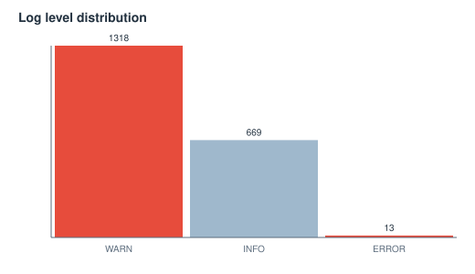
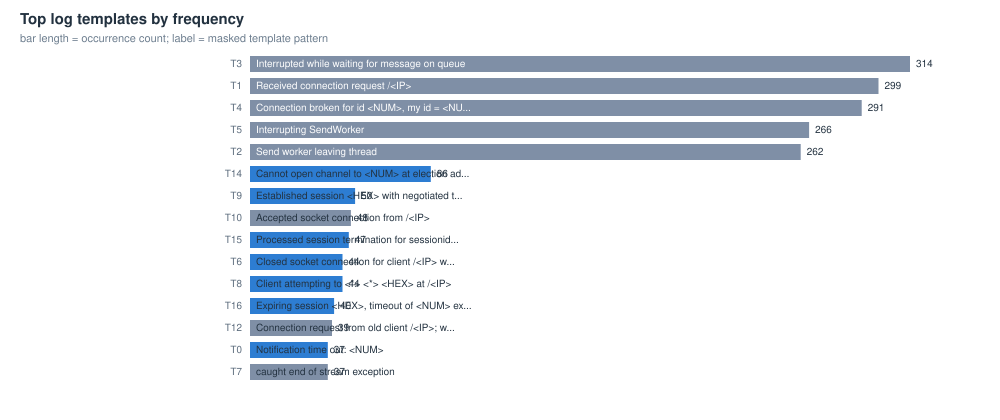
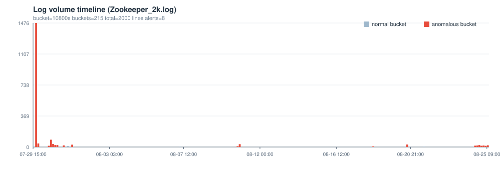

# Zookeeper_2k 日志解析与异常检测报告

> 自动生成于 2026-10-06 00:56:46 ｜ 工具 loglens v0.1.0 ｜ 数据文件 data/Zookeeper_2k.log

## 0 结论速览

- **解析**：2000 行原始日志，结构化解析 2000 行，解析率 100.00%（自动识别格式 zookeeper，编码 utf-8）
- **模板**：46 个模板（单例模板 16 个），时间桶宽 3h，共 215 个桶
- **异常**：检出 8 个异常窗口（high 6 / medium 1 / low 1），单点判定 153 条，各检测器：ewma=12, novelty=11, poisson=67, robust_z=44, rules=19
- **最值得先看**：窗口 08-20 15:00:00 ~ 15:00:00（约 3.0 小时）；模板 T16 计数异常（观测 5 次 / 基线 0.16 次）；出现 3 个观察期后的新模板；规则命中 exception-traceback/io-error；量级突变 volume-up/warn-volume-up；检测器 ewma+novelty+poisson+robust_z+rules

## 1 数据概览

| 指标 | 值 | 指标 | 值 |
|---|---|---|---|
| 文件 | data/Zookeeper_2k.log | 格式 | zookeeper（匹配率 1.000） |
| 原始行数 | 2000 | 空行 | 0 |
| 解析记录 | 2000 | 兜底行 | 0 |
| 解析率 | 100.00% | 编码 | utf-8 |
| 时间范围 | 2015-07-29 17:41:44 ~ 2015-08-25 11:26:28 | 跨度 | 26.7d |
| 时间桶宽 | 3h | 桶数 | 215 |

### 1.1 级别与来源分布

**级别分布**

| 级别 | 条数 | 占比 |
|---|---|---|
| WARN | 1318 | 65.9% |
| INFO | 669 | 33.5% |
| ERROR | 13 | 0.7% |

**来源 Top 10（logger / 进程）**

| 来源 | 条数 | 占比 |
|---|---|---|
| QuorumCnxManager$SendWorker@679 | 314 | 15.7% |
| QuorumCnxManager$Listener@493 | 299 | 14.9% |
| QuorumCnxManager$RecvWorker@762 | 291 | 14.6% |
| QuorumCnxManager$RecvWorker@765 | 266 | 13.3% |
| QuorumCnxManager$SendWorker@688 | 262 | 13.1% |
| QuorumCnxManager@368 | 86 | 4.3% |
| ZooKeeperServer@595 | 50 | 2.5% |
| NIOServerCnxn@1001 | 48 | 2.4% |
| NIOServerCnxnFactory@197 | 48 | 2.4% |
| PrepRequestProcessor@476 | 47 | 2.4% |




## 2 模板挖掘（时间/级别/来源/事件形态）

解析层负责把时间、级别、来源抽成字段；模板层负责把正文里的变量（block id、IP、数字、路径…）掩码后聚类成有限个「事件形态」，这是后续所有统计检验的坐标系。

| 模板 | 形态（已掩码） | 次数 | 占比 | 首次出现 | 末次出现 | 主要级别 |
|---|---|---|---|---|---|---|
| T3 | [Interrupted while waiting for message on queue] | 314 | 15.7% | 2015-07-29 19:04:29 | 2015-07-31 19:02:04 | WARN |
| T1 | [Received connection request /<IP>] | 299 | 14.9% | 2015-07-29 19:04:12 | 2015-08-18 16:09:13 | INFO |
| T4 | [Connection broken for id <NUM>, my id = <NUM>, error =] | 291 | 14.6% | 2015-07-29 19:13:24 | 2015-08-25 11:20:12 | WARN |
| T5 | [Interrupting SendWorker] | 266 | 13.3% | 2015-07-29 19:14:07 | 2015-07-30 23:49:40 | WARN |
| T2 | [Send worker leaving thread] | 262 | 13.1% | 2015-07-29 19:04:29 | 2015-07-29 19:53:12 | WARN |
| T14 | [Cannot open channel to <NUM> at election address /<IP>] | 86 | 4.3% | 2015-07-29 17:42:53 | 2015-08-25 11:21:22 | WARN |
| T9 | [Established session <HEX> with negotiated timeout <NUM> for client /<IP>] | 50 | 2.5% | 2015-07-29 21:01:45 | 2015-08-20 19:02:23 | INFO |
| T10 | [Accepted socket connection from /<IP>] | 48 | 2.4% | 2015-07-29 19:48:30 | 2015-08-21 15:55:14 | INFO |
| T15 | [Processed session termination for sessionid: <HEX>] | 47 | 2.4% | 2015-07-29 19:52:16 | 2015-08-25 11:15:04 | INFO |
| T6 | [Closed socket connection for client /<IP> which had sessionid <HEX>] | 44 | 2.2% | 2015-07-29 19:52:04 | 2015-08-20 19:33:02 | INFO |
| T8 | [Client attempting to <*> <*> <HEX> at /<IP>] | 44 | 2.2% | 2015-07-29 19:54:05 | 2015-08-21 15:55:09 | INFO |
| T16 | [Expiring session <HEX>, timeout of <NUM> exceeded] | 40 | 2.0% | 2015-07-29 21:34:48 | 2015-08-25 11:15:04 | INFO |
| T12 | [Connection request from old client /<IP>; will be dropped if server is in r-o mode] | 39 | 1.9% | 2015-07-29 19:54:05 | 2015-08-21 15:55:10 | WARN |
| T0 | [Notification time out: <NUM>] | 37 | 1.9% | 2015-07-29 17:41:44 | 2015-08-25 10:50:16 | INFO |
| T7 | [caught end of stream exception] | 37 | 1.9% | 2015-07-29 19:39:01 | 2015-08-20 19:33:02 | WARN |




## 3 异常检测结果

### 3.1 检测器与参数

| 检测器 | 方法 | 阈值/规则 |
|---|---|---|
| 稳健 z-score（模板计数） | MAD 估计 sigma | z >= 5.0，且计数 >= max(3, 中位数+3.0) |
| 泊松尾检验 | 上尾概率 + BH-FDR | p <= 0.01 粗筛，FDR q = 0.05，基线速率 >= 0.05 |
| EWMA 控制图 | 指数加权均值/方差 | lambda = 0.25，控制限 L = 4.0 |
| 新模板（novelty） | 观察期后首次出现 | 观察期 = 前 10% 时间桶 |
| 规则（关键词/级别） | 运维经验规则表 | 命中阈值按规则配置；权重上限 1.2 |
| 窗口融合 | 加权求和 | 桶分数 >= 1.0 判为异常桶，连续异常桶合并为事件 |

| 检测器 | 单点判定数 |
|---|---|
| poisson | 67 |
| robust_z | 44 |
| rules | 19 |
| ewma | 12 |
| novelty | 11 |

### 3.2 异常窗口（事件）列表

| 序号 | 开始 | 结束 | 时长 | 分数 | 严重度 | 检测器 | 涉及模板 | 摘要 |
|---|---|---|---|---|---|---|---|---|
| #1 | 2015-08-20 15:00:00 | 2015-08-20 15:00:00 | 3h | 7.30 | high | ewma,novelty,poisson,robust_z,rules | T16,T9,T6,T10,T30 | 窗口 08-20 15:00:00 ~ 15:00:00（约 3.0 小时）；模板 T16 计数异常（观测 5 次 / 基线 0.16 次）；出现 3 个观察期后的新模板；规则命中 exception-traceback/io-error；量级突变 volume-up/warn-volume-up；检测器 ewm... |
| #2 | 2015-07-29 18:00:00 | 2015-07-29 21:00:00 | 6h | 6.60 | high | ewma,poisson,robust_z,rules | T10,T15,T1,T2,T3 | 窗口 07-29 18:00:00 ~ 21:00:00（约 6.0 小时）；模板 T10 计数异常（观测 9 次 / 基线 0.18 次）；规则命中 error-level/exception-traceback/zk-quorum；量级突变 error-volume-up/volume-up/warn-vol... |
| #3 | 2015-08-10 15:00:00 | 2015-08-10 18:00:00 | 6h | 6.40 | high | ewma,novelty,poisson,robust_z,rules | T12,T7,T9,T6,T8 | 窗口 08-10 15:00:00 ~ 18:00:00（约 6.0 小时）；模板 T7 计数异常（观测 5 次 / 基线 0.15 次）；出现 4 个观察期后的新模板；规则命中 exception-traceback；量级突变 volume-up/warn-volume-up；检测器 ewma+novelty+... |
| #4 | 2015-08-24 15:00:00 | 2015-08-25 09:00:00 | 21h | 4.40 | high | ewma,novelty,poisson,robust_z,rules | T14,T0,T31,T42,T43 | 窗口 08-24 15:00:00 ~ 09:00:00（约 21.0 小时）；模板 T14 计数异常（观测 11 次 / 基线 0.35 次）；出现 3 个观察期后的新模板；规则命中 zk-quorum；量级突变 volume-up/warn-volume-up；检测器 ewma+novelty+poisson... |
| #5 | 2015-07-30 12:00:00 | 2015-07-31 00:00:00 | 15h | 3.40 | high | poisson,robust_z,rules | T9,T6,T10,T7,T12 | 窗口 07-30 12:00:00 ~ 00:00:00（约 15.0 小时）；模板 T6 计数异常（观测 11 次 / 基线 0.15 次）；规则命中 exception-traceback；检测器 poisson+robust_z+rules |
| #6 | 2015-07-31 21:00:00 | 2015-07-31 21:00:00 | 3h | 3.00 | high | poisson,robust_z | T16,T9,T15,T6,T8 | 窗口 07-31 21:00:00 ~ 21:00:00（约 3.0 小时）；模板 T16 计数异常（观测 6 次 / 基线 0.16 次）；检测器 poisson+robust_z |
| #7 | 2015-07-31 09:00:00 | 2015-07-31 09:00:00 | 3h | 2.80 | medium | poisson,robust_z | T12,T6,T16 | 窗口 07-31 09:00:00 ~ 09:00:00（约 3.0 小时）；模板 T12 计数异常（观测 5 次 / 基线 0.16 次）；检测器 poisson+robust_z |
| #8 | 2015-08-18 15:00:00 | 2015-08-18 15:00:00 | 3h | 1.20 | low | ewma,novelty | T39 | 窗口 08-18 15:00:00 ~ 15:00:00（约 3.0 小时）；出现 1 个观察期后的新模板；量级突变 volume-up；检测器 ewma+novelty |




### 3.3 重点异常窗口证据

#### 事件 #1 ｜ 2015-08-20 15:00:00 ~ 2015-08-20 15:00:00 ｜ 分数 7.30 ｜ high

**摘要**：窗口 08-20 15:00:00 ~ 15:00:00（约 3.0 小时）；模板 T16 计数异常（观测 5 次 / 基线 0.16 次）；出现 3 个观察期后的新模板；规则命中 exception-traceback/io-error；量级突变 volume-up/warn-volume-up；检测器 ewma+novelty+poisson+robust_z+rules

**判断依据**

- 模板 T16 本桶 5 次，基线速率 0.164 次/桶（放大 30.6 倍），泊松上尾 p = 8.51e-07，在 67 次检验中经 BH-FDR(q=0.05) 校正后仍显著
- 模板 T9 本桶 4 次，基线速率 0.215 次/桶（放大 18.6 倍），泊松上尾 p = 7.49e-05，在 67 次检验中经 BH-FDR(q=0.05) 校正后仍显著
- 模板 T6 本桶 3 次，基线速率 0.192 次/桶（放大 15.7 倍），泊松上尾 p = 1.02e-03，在 67 次检验中经 BH-FDR(q=0.05) 校正后仍显著
- 模板 T10 本桶 3 次，基线速率 0.21 次/桶（放大 14.3 倍），泊松上尾 p = 1.32e-03，在 67 次检验中经 BH-FDR(q=0.05) 校正后仍显著
- 模板 T16 在本桶出现 5 次，历史中位数 0.0 次，稳健 z = 5.0（阈值 5.0，sigma=1.0）
- warn-volume 本桶 5 条，历史中位数 0.0 条，偏离控制限 74085.6 sigma（L=4.0，方向 上升）
- IO/网络异常；本桶命中 3 次（规则阈值 1 次，全文共 3 次）
- volume 本桶 30 条，历史中位数 0.0 条，偏离控制限 11.3 sigma（L=4.0，方向 上升）；环比上一桶 6.0 倍
- 模板 T30 首次出现在观察期之后（第 177/215 个时间桶），全文共 3 次，主要级别 WARN；模板形态：Exception causing close of session <HEX> due to java.io.IOException: ZooKeeperServer not running
- 模板 T40 首次出现在观察期之后（第 177/215 个时间桶），全文共 1 次，主要级别 INFO；模板形态：shutdown of request processor complete
- 模板 T41 首次出现在观察期之后（第 177/215 个时间桶），全文共 1 次，主要级别 WARN；模板形态：First is <HEX>
- 异常/堆栈：通常是故障的直接现场；本桶命中 4 次（规则阈值 2 次，全文共 53 次）

**涉及模板**

- T16：Expiring session <HEX>, timeout of <NUM> exceeded
- T9：Established session <HEX> with negotiated timeout <NUM> for client /<IP>
- T6：Closed socket connection for client /<IP> which had sessionid <HEX>
- T10：Accepted socket connection from /<IP>
- T30：Exception causing close of session <HEX> due to java.io.IOException: ZooKeeperServer not running

**原始日志证据（可回溯到行号）**

```text
L1427 | 2015-08-20 17:12:28 | 2015-08-20 17:12:28,002 - INFO  [SessionTracker:ZooKeeperServer@325] - Expiring session 0x24f3fdaf738000a, timeout of 10000ms exceeded
L1436 | 2015-08-20 17:14:24 | 2015-08-20 17:14:24,000 - INFO  [SessionTracker:ZooKeeperServer@325] - Expiring session 0x14f3fdae8ba0017, timeout of 10000ms exceeded
L1437 | 2015-08-20 17:14:24 | 2015-08-20 17:14:24,000 - INFO  [SessionTracker:ZooKeeperServer@325] - Expiring session 0x14f3fdae8ba000c, timeout of 10000ms exceeded
L627 | 2015-08-20 17:22:22 | 2015-08-20 17:22:22,288 - INFO  [CommitProcessor:1:ZooKeeperServer@595] - Established session 0x14f4a6318b80005 with negotiated timeout 10000 for client /10.10.34.11:56492
L630 | 2015-08-20 17:24:07 | 2015-08-20 17:24:07,816 - INFO  [CommitProcessor:1:ZooKeeperServer@595] - Established session 0x14f4a6318b80013 with negotiated timeout 10000 for client /10.10.34.20:43137
L1441 | 2015-08-20 17:24:09 | 2015-08-20 17:24:09,157 - INFO  [CommitProcessor:2:ZooKeeperServer@595] - Established session 0x24f4a631df9000e with negotiated timeout 10000 for client /10.10.34.16:53681
```

#### 事件 #2 ｜ 2015-07-29 18:00:00 ~ 2015-07-29 21:00:00 ｜ 分数 6.60 ｜ high

**摘要**：窗口 07-29 18:00:00 ~ 21:00:00（约 6.0 小时）；模板 T10 计数异常（观测 9 次 / 基线 0.18 次）；规则命中 error-level/exception-traceback/zk-quorum；量级突变 error-volume-up/volume-up/warn-volume-up；检测器 ewma+poisson+robust_z+rules

**判断依据**

- 模板 T1 在本桶出现 294 次，历史中位数 0.0 次，稳健 z = 294.0（阈值 5.0，sigma=1.0）
- 模板 T2 在本桶出现 262 次，历史中位数 0.0 次，稳健 z = 262.0（阈值 5.0，sigma=1.0）
- 模板 T3 在本桶出现 313 次，历史中位数 0.0 次，稳健 z = 313.0（阈值 5.0，sigma=1.0）
- 模板 T4 在本桶出现 289 次，历史中位数 0.0 次，稳健 z = 289.0（阈值 5.0，sigma=1.0）
- 模板 T5 在本桶出现 265 次，历史中位数 0.0 次，稳健 z = 265.0（阈值 5.0，sigma=1.0）
- 模板 T10 本桶 9 次，基线速率 0.182 次/桶（放大 49.4 倍），泊松上尾 p = 5.19e-13，在 67 次检验中经 BH-FDR(q=0.05) 校正后仍显著
- 模板 T8 本桶 7 次，基线速率 0.173 次/桶（放大 40.5 倍），泊松上尾 p = 7.88e-10，在 67 次检验中经 BH-FDR(q=0.05) 校正后仍显著
- 模板 T15 本桶 7 次，基线速率 0.187 次/桶（放大 37.4 倍），泊松上尾 p = 1.34e-09，在 67 次检验中经 BH-FDR(q=0.05) 校正后仍显著
- 模板 T9 本桶 7 次，基线速率 0.201 次/桶（放大 34.8 倍），泊松上尾 p = 2.20e-09，在 67 次检验中经 BH-FDR(q=0.05) 校正后仍显著
- 模板 T10 本桶 6 次，基线速率 0.196 次/桶（放大 30.6 倍），泊松上尾 p = 6.71e-08，在 67 次检验中经 BH-FDR(q=0.05) 校正后仍显著
- 模板 T16 本桶 5 次，基线速率 0.164 次/桶（放大 30.6 倍），泊松上尾 p = 8.51e-07，在 67 次检验中经 BH-FDR(q=0.05) 校正后仍显著
- 模板 T17 在本桶出现 18 次，历史中位数 0.0 次，稳健 z = 18.0（阈值 5.0，sigma=1.0）

**涉及模板**

- T10：Accepted socket connection from /<IP>
- T15：Processed session termination for sessionid: <HEX>
- T1：Received connection request /<IP>
- T2：Send worker leaving thread
- T3：Interrupted while waiting for message on queue

**原始日志证据（可回溯到行号）**

```text
L2 | 2015-07-29 19:04:12 | 2015-07-29 19:04:12,394 - INFO  [/10.10.34.11:3888:QuorumCnxManager$Listener@493] - Received connection request /10.10.34.11:45307
L7 | 2015-07-29 19:13:24 | 2015-07-29 19:13:24,370 - INFO  [/10.10.34.11:3888:QuorumCnxManager$Listener@493] - Received connection request /10.10.34.13:57707
L13 | 2015-07-29 19:13:54 | 2015-07-29 19:13:54,220 - INFO  [/10.10.34.11:3888:QuorumCnxManager$Listener@493] - Received connection request /10.10.34.11:45382
L3 | 2015-07-29 19:04:29 | 2015-07-29 19:04:29,071 - WARN  [SendWorker:188978561024:QuorumCnxManager$SendWorker@688] - Send worker leaving thread
L5 | 2015-07-29 19:13:17 | 2015-07-29 19:13:17,524 - WARN  [SendWorker:188978561024:QuorumCnxManager$SendWorker@688] - Send worker leaving thread
L10 | 2015-07-29 19:13:37 | 2015-07-29 19:13:37,626 - WARN  [SendWorker:188978561024:QuorumCnxManager$SendWorker@688] - Send worker leaving thread
```

#### 事件 #3 ｜ 2015-08-10 15:00:00 ~ 2015-08-10 18:00:00 ｜ 分数 6.40 ｜ high

**摘要**：窗口 08-10 15:00:00 ~ 18:00:00（约 6.0 小时）；模板 T7 计数异常（观测 5 次 / 基线 0.15 次）；出现 4 个观察期后的新模板；规则命中 exception-traceback；量级突变 volume-up/warn-volume-up；检测器 ewma+novelty+poisson+robust_z+rules

**判断依据**

- 模板 T7 本桶 5 次，基线速率 0.15 次/桶（放大 33.4 倍），泊松上尾 p = 5.50e-07，在 67 次检验中经 BH-FDR(q=0.05) 校正后仍显著
- 模板 T9 本桶 5 次，基线速率 0.21 次/桶（放大 23.8 倍），泊松上尾 p = 2.88e-06，在 67 次检验中经 BH-FDR(q=0.05) 校正后仍显著
- 模板 T12 本桶 3 次，基线速率 0.168 次/桶（放大 17.8 倍），泊松上尾 p = 7.00e-04，在 67 次检验中经 BH-FDR(q=0.05) 校正后仍显著
- 模板 T12 本桶 3 次，基线速率 0.168 次/桶（放大 17.8 倍），泊松上尾 p = 7.00e-04，在 67 次检验中经 BH-FDR(q=0.05) 校正后仍显著
- 模板 T6 本桶 3 次，基线速率 0.192 次/桶（放大 15.7 倍），泊松上尾 p = 1.02e-03，在 67 次检验中经 BH-FDR(q=0.05) 校正后仍显著
- 模板 T8 本桶 3 次，基线速率 0.192 次/桶（放大 15.7 倍），泊松上尾 p = 1.02e-03，在 67 次检验中经 BH-FDR(q=0.05) 校正后仍显著
- 模板 T7 在本桶出现 5 次，历史中位数 0.0 次，稳健 z = 5.0（阈值 5.0，sigma=1.0）
- 模板 T9 在本桶出现 5 次，历史中位数 0.0 次，稳健 z = 5.0（阈值 5.0，sigma=1.0）
- warn-volume 本桶 4 条，历史中位数 0.0 条，偏离控制限 291.0 sigma（L=4.0，方向 上升）
- volume 本桶 9 条，历史中位数 0.0 条，偏离控制限 164.0 sigma（L=4.0，方向 上升）
- volume 本桶 34 条，历史中位数 0.0 条，偏离控制限 7.1 sigma（L=4.0，方向 上升）；环比上一桶 3.78 倍
- 模板 T25 首次出现在观察期之后（第 98/215 个时间桶），全文共 1 次，主要级别 INFO；模板形态：autopurge.snapRetainCount set to <NUM>

**涉及模板**

- T12：Connection request from old client /<IP>; will be dropped if server is in r-o mode
- T7：caught end of stream exception
- T9：Established session <HEX> with negotiated timeout <NUM> for client /<IP>
- T6：Closed socket connection for client /<IP> which had sessionid <HEX>
- T8：Client attempting to <*> <*> <HEX> at /<IP>

**原始日志证据（可回溯到行号）**

```text
L605 | 2015-08-10 18:12:24 | 2015-08-10 18:12:24,076 - WARN  [NIOServerCxn.Factory:0.0.0.0/0.0.0.0:2181:NIOServerCnxn@349] - caught end of stream exception
L606 | 2015-08-10 18:12:24 | 2015-08-10 18:12:24,375 - WARN  [NIOServerCxn.Factory:0.0.0.0/0.0.0.0:2181:NIOServerCnxn@349] - caught end of stream exception
L617 | 2015-08-10 18:25:39 | 2015-08-10 18:25:39,907 - WARN  [NIOServerCxn.Factory:0.0.0.0/0.0.0.0:2181:NIOServerCnxn@349] - caught end of stream exception
L607 | 2015-08-10 18:13:25 | 2015-08-10 18:13:25,200 - INFO  [CommitProcessor:1:ZooKeeperServer@595] - Established session 0x14f05578bd80020 with negotiated timeout 10000 for client /10.10.34.11:38390
L611 | 2015-08-10 18:23:52 | 2015-08-10 18:23:52,649 - INFO  [QuorumPeer[myid=1]/0:0:0:0:0:0:0:0:2181:ZooKeeperServer@595] - Established session 0x14f05578bd80016 with negotiated timeout 10000 for client /10.10.34.13:38490
L612 | 2015-08-10 18:23:52 | 2015-08-10 18:23:52,650 - INFO  [QuorumPeer[myid=1]/0:0:0:0:0:0:0:0:2181:ZooKeeperServer@595] - Established session 0x14f05578bd80013 with negotiated timeout 10000 for client /10.10.34.11:38530
```

#### 事件 #4 ｜ 2015-08-24 15:00:00 ~ 2015-08-25 09:00:00 ｜ 分数 4.40 ｜ high

**摘要**：窗口 08-24 15:00:00 ~ 09:00:00（约 21.0 小时）；模板 T14 计数异常（观测 11 次 / 基线 0.35 次）；出现 3 个观察期后的新模板；规则命中 zk-quorum；量级突变 volume-up/warn-volume-up；检测器 ewma+novelty+poisson+robust_z+rules

**判断依据**

- 模板 T14 本桶 11 次，基线速率 0.35 次/桶（放大 31.4 倍），泊松上尾 p = 1.78e-13，在 67 次检验中经 BH-FDR(q=0.05) 校正后仍显著
- 模板 T14 本桶 12 次，基线速率 0.346 次/桶（放大 34.7 倍），泊松上尾 p = 4.44e-15，在 67 次检验中经 BH-FDR(q=0.05) 校正后仍显著
- 模板 T14 本桶 15 次，基线速率 0.332 次/桶（放大 45.2 倍），泊松上尾 p = 0.00e+00，在 67 次检验中经 BH-FDR(q=0.05) 校正后仍显著
- 模板 T14 本桶 12 次，基线速率 0.346 次/桶（放大 34.7 倍），泊松上尾 p = 4.44e-15，在 67 次检验中经 BH-FDR(q=0.05) 校正后仍显著
- 模板 T14 本桶 11 次，基线速率 0.35 次/桶（放大 31.4 倍），泊松上尾 p = 1.78e-13，在 67 次检验中经 BH-FDR(q=0.05) 校正后仍显著
- 模板 T0 本桶 8 次，基线速率 0.136 次/桶（放大 59.0 倍），泊松上尾 p = 2.50e-12，在 67 次检验中经 BH-FDR(q=0.05) 校正后仍显著
- 模板 T14 本桶 10 次，基线速率 0.355 次/桶（放大 28.2 倍），泊松上尾 p = 6.37e-12，在 67 次检验中经 BH-FDR(q=0.05) 校正后仍显著
- 模板 T14 本桶 8 次，基线速率 0.364 次/桶（放大 21.9 倍），泊松上尾 p = 5.59e-09，在 67 次检验中经 BH-FDR(q=0.05) 校正后仍显著
- 模板 T0 本桶 6 次，基线速率 0.145 次/桶（放大 41.4 倍），泊松上尾 p = 1.13e-08，在 67 次检验中经 BH-FDR(q=0.05) 校正后仍显著
- 模板 T0 本桶 6 次，基线速率 0.145 次/桶（放大 41.4 倍），泊松上尾 p = 1.13e-08，在 67 次检验中经 BH-FDR(q=0.05) 校正后仍显著
- 模板 T0 本桶 5 次，基线速率 0.15 次/桶（放大 33.4 倍），泊松上尾 p = 5.50e-07，在 67 次检验中经 BH-FDR(q=0.05) 校正后仍显著
- 模板 T0 本桶 4 次，基线速率 0.154 次/桶（放大 25.9 倍），泊松上尾 p = 2.08e-05，在 67 次检验中经 BH-FDR(q=0.05) 校正后仍显著

**涉及模板**

- T14：Cannot open channel to <NUM> at election address /<IP>
- T0：Notification time out: <NUM>
- T31：tickTime set to <NUM>
- T42：Reading snapshot <PATH>
- T43：Sending DIFF

**原始日志证据（可回溯到行号）**

```text
L639 | 2015-08-24 15:27:03 | 2015-08-24 15:27:03,681 - WARN  [WorkerSender[myid=1]:QuorumCnxManager@368] - Cannot open channel to 3 at election address /10.10.34.13:3888
L640 | 2015-08-24 15:29:13 | 2015-08-24 15:29:13,641 - WARN  [QuorumPeer[myid=1]/0:0:0:0:0:0:0:0:2181:QuorumCnxManager@368] - Cannot open channel to 3 at election address /10.10.34.13:3888
L642 | 2015-08-24 15:37:13 | 2015-08-24 15:37:13,664 - WARN  [QuorumPeer[myid=1]/0:0:0:0:0:0:0:0:2181:QuorumCnxManager@368] - Cannot open channel to 2 at election address /10.10.34.12:3888
L656 | 2015-08-24 18:28:14 | 2015-08-24 18:28:14,133 - WARN  [QuorumPeer[myid=1]/0:0:0:0:0:0:0:0:2181:QuorumCnxManager@368] - Cannot open channel to 2 at election address /10.10.34.12:3888
L657 | 2015-08-24 18:31:14 | 2015-08-24 18:31:14,142 - WARN  [QuorumPeer[myid=1]/0:0:0:0:0:0:0:0:2181:QuorumCnxManager@368] - Cannot open channel to 3 at election address /10.10.34.13:3888
L660 | 2015-08-24 18:51:14 | 2015-08-24 18:51:14,196 - WARN  [QuorumPeer[myid=1]/0:0:0:0:0:0:0:0:2181:QuorumCnxManager@368] - Cannot open channel to 2 at election address /10.10.34.12:3888
```

#### 事件 #5 ｜ 2015-07-30 12:00:00 ~ 2015-07-31 00:00:00 ｜ 分数 3.40 ｜ high

**摘要**：窗口 07-30 12:00:00 ~ 00:00:00（约 15.0 小时）；模板 T6 计数异常（观测 11 次 / 基线 0.15 次）；规则命中 exception-traceback；检测器 poisson+robust_z+rules

**判断依据**

- 模板 T6 本桶 11 次，基线速率 0.154 次/桶（放大 71.3 倍），泊松上尾 p = 0.00e+00，在 67 次检验中经 BH-FDR(q=0.05) 校正后仍显著
- 模板 T7 本桶 11 次，基线速率 0.121 次/桶（放大 90.5 倍），泊松上尾 p = 0.00e+00，在 67 次检验中经 BH-FDR(q=0.05) 校正后仍显著
- 模板 T8 本桶 11 次，基线速率 0.154 次/桶（放大 71.3 倍），泊松上尾 p = 0.00e+00，在 67 次检验中经 BH-FDR(q=0.05) 校正后仍显著
- 模板 T9 本桶 10 次，基线速率 0.187 次/桶（放大 53.5 倍），泊松上尾 p = 1.20e-14，在 67 次检验中经 BH-FDR(q=0.05) 校正后仍显著
- 模板 T10 本桶 10 次，基线速率 0.178 次/桶（放大 56.3 倍），泊松上尾 p = 7.33e-15，在 67 次检验中经 BH-FDR(q=0.05) 校正后仍显著
- 模板 T12 本桶 11 次，基线速率 0.131 次/桶（放大 84.1 倍），泊松上尾 p = 0.00e+00，在 67 次检验中经 BH-FDR(q=0.05) 校正后仍显著
- 模板 T15 本桶 10 次，基线速率 0.173 次/桶（放大 57.8 倍），泊松上尾 p = 5.66e-15，在 67 次检验中经 BH-FDR(q=0.05) 校正后仍显著
- 模板 T16 本桶 7 次，基线速率 0.154 次/桶（放大 45.4 倍），泊松上尾 p = 3.60e-10，在 67 次检验中经 BH-FDR(q=0.05) 校正后仍显著
- 模板 T15 本桶 7 次，基线速率 0.187 次/桶（放大 37.4 倍），泊松上尾 p = 1.34e-09，在 67 次检验中经 BH-FDR(q=0.05) 校正后仍显著
- 模板 T8 本桶 6 次，基线速率 0.178 次/桶（放大 33.8 倍），泊松上尾 p = 3.74e-08，在 67 次检验中经 BH-FDR(q=0.05) 校正后仍显著
- 模板 T9 本桶 6 次，基线速率 0.206 次/桶（放大 29.2 倍），泊松上尾 p = 8.80e-08，在 67 次检验中经 BH-FDR(q=0.05) 校正后仍显著
- 模板 T7 本桶 5 次，基线速率 0.15 次/桶（放大 33.4 倍），泊松上尾 p = 5.50e-07，在 67 次检验中经 BH-FDR(q=0.05) 校正后仍显著

**涉及模板**

- T9：Established session <HEX> with negotiated timeout <NUM> for client /<IP>
- T6：Closed socket connection for client /<IP> which had sessionid <HEX>
- T10：Accepted socket connection from /<IP>
- T7：caught end of stream exception
- T12：Connection request from old client /<IP>; will be dropped if server is in r-o mode

**原始日志证据（可回溯到行号）**

```text
L521 | 2015-07-30 15:41:40 | 2015-07-30 15:41:40,669 - INFO  [NIOServerCxn.Factory:0.0.0.0/0.0.0.0:2181:NIOServerCnxn@1001] - Closed socket connection for client /10.10.34.11:50940 which had sessionid 0x14ed93111f20099
L522 | 2015-07-30 16:09:17 | 2015-07-30 16:09:17,019 - INFO  [NIOServerCxn.Factory:0.0.0.0/0.0.0.0:2181:NIOServerCnxn@1001] - Closed socket connection for client /10.10.34.11:52893 which had sessionid 0x14ed93111f2009b
L531 | 2015-07-30 16:44:26 | 2015-07-30 16:44:26,593 - INFO  [NIOServerCxn.Factory:0.0.0.0/0.0.0.0:2181:NIOServerCnxn@1001] - Closed socket connection for client /10.10.34.12:45682 which had sessionid 0x14ed93111f200cd
L536 | 2015-07-30 17:11:54 | 2015-07-30 17:11:54,937 - WARN  [NIOServerCxn.Factory:0.0.0.0/0.0.0.0:2181:NIOServerCnxn@349] - caught end of stream exception
L538 | 2015-07-30 17:22:34 | 2015-07-30 17:22:34,245 - WARN  [NIOServerCxn.Factory:0.0.0.0/0.0.0.0:2181:NIOServerCnxn@349] - caught end of stream exception
L1303 | 2015-07-30 15:34:30 | 2015-07-30 15:34:30,623 - WARN  [NIOServerCxn.Factory:0.0.0.0/0.0.0.0:2181:NIOServerCnxn@349] - caught end of stream exception
```

## 4 方法选择与局限（漏报 / 误报）

本项目采用「模板挖掘 + 统计检验」为主线、关键词规则为补充的混合方案：无需标注数据、每个判定都能给出统计量与原始日志证据、只依赖 numpy/pandas，适合 5~8 人小团队快速落地。方法与选型理由见 docs/01-method-research.md。

**已知漏报场景**：① 日志格式或模板发生演化（同一事件被掩码/分词成新模板）；② 异常以少量单条形式出现（计数未达到 min_observed 与 z 阈值）；③ 静默失败（系统直接挂掉、日志中断，错误行根本没写出来）；④ 规则表未覆盖的故障语义；⑤ 时间桶过宽把突发摊平。

**已知误报场景**：① 正常业务突增（促销、批处理窗口、集群扩容）；② 重启/版本升级带来大批新模板；③ 上游依赖抖动导致的连锁重试；④ 日志轮转或采样策略变化引起的量级跳变；⑤ 规则表过宽的关键词（例如把普通包含 error 字样的行判为错误）。

完整的失效模式、量化评测与缓解手段见 docs/03-false-alarm-analysis.md。

## 5 复现命令

```bash
python -m loglens run -i data/Zookeeper_2k.log -o results/Zookeeper --format zookeeper
```
