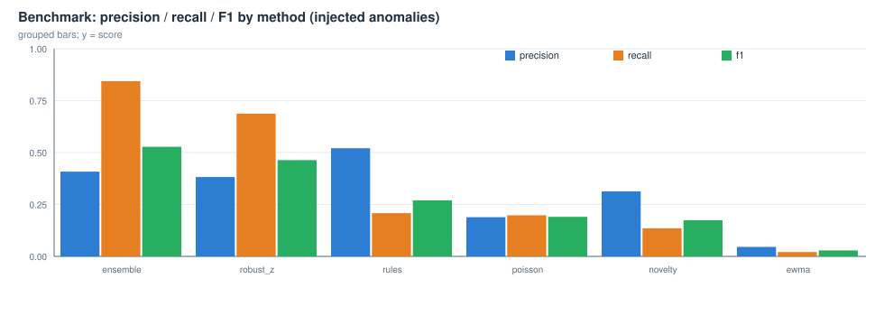

# 注入式基准评测报告（检测能力量化）

> 目的：在没有人工标注的公开日志上，量化各检测器的精确率 / 召回率 / F1，并据此选择默认阈值。用法：python -m loglens bench

## 1 评测设置

- 基准日志：HDFS_2k.log、Linux_2k.log、Apache_2k.log、Zookeeper_2k.log
- 随机种子：42, 43；每个文件注入 12 个异常窗口
- 注入类型：burst（模板计数突增，18~45 行）、novel（新错误模板，3~8 行）、escalation（窗口内级别改写为 ERROR，最多 20 行）
- 匹配规则：注入窗口与异常窗口时间重叠即命中；未与任何注入窗口重叠的异常窗口计为误报

| 文件 | 格式 | 种子 | 注入后行数 | 注入窗口数 | 类型 |
|---|---|---|---|---|---|
| HDFS_2k | hdfs | 42 | 2147 | 12 | burst/escalation/novel |
| HDFS_2k | hdfs | 43 | 2163 | 12 | burst/escalation/novel |
| Linux_2k | linux | 42 | 2146 | 12 | burst/escalation/novel |
| Linux_2k | linux | 43 | 2140 | 12 | burst/escalation/novel |
| Apache_2k | apache | 42 | 2152 | 12 | burst/escalation/novel |
| Apache_2k | apache | 43 | 2162 | 12 | burst/escalation/novel |
| Zookeeper_2k | zookeeper | 42 | 2154 | 12 | burst/escalation/novel |
| Zookeeper_2k | zookeeper | 43 | 2161 | 12 | burst/escalation/novel |

## 2 各方法总体指标（跨文件、跨种子平均）

| 方法 | 精确率 P | 召回率 R | F1 | burst 召回 | novel 召回 | escalation 召回 |
|---|---|---|---|---|---|---|
| ensemble | 0.408 | 0.844 | 0.528 | 1.000 | 0.969 | 0.562 |
| robust_z | 0.382 | 0.688 | 0.464 | 1.000 | 0.562 | 0.500 |
| rules | 0.521 | 0.208 | 0.270 | 0.125 | 0.469 | 0.031 |
| poisson | 0.189 | 0.198 | 0.191 | 0.250 | 0.219 | 0.125 |
| novelty | 0.313 | 0.135 | 0.174 | 0.062 | 0.156 | 0.188 |
| ewma | 0.046 | 0.021 | 0.029 | 0.062 | 0.000 | 0.000 |

## 3 检测器灵敏度（单点判定层面，消融实验）

说明：融合层给弱信号设置了低于窗口阈值的权重（规则、新模板、EWMA、泊松需要与其它信号相互印证才成窗），因此只看「窗口」会低估它们的灵敏度。本表改为统计单点判定是否落在注入窗口内：sensitivity = 被命中的注入窗口比例；precision_like = 落在注入窗口内的判定占比（未落在任何注入窗口内的判定不一定是错，真实日志本身就有异常，故称 precision-like）。

| 方法 | 灵敏度 | precision-like | burst 灵敏度 | novel 灵敏度 | escalation 灵敏度 |
|---|---|---|---|---|---|
| ensemble | 0.875 | 0.195 | 1.000 | 1.000 | 0.625 |
| robust_z | 0.688 | 0.189 | 1.000 | 0.562 | 0.500 |
| rules | 0.677 | 0.304 | 0.406 | 1.000 | 0.625 |
| poisson | 0.656 | 0.180 | 0.969 | 0.562 | 0.438 |
| ewma | 0.240 | 0.180 | 0.219 | 0.344 | 0.156 |
| novelty | 0.156 | 0.234 | 0.125 | 0.156 | 0.188 |

## 4 融合阈值扫描（ensemble）

| window_threshold | 精确率 P | 召回率 R | F1 | 平均异常窗口数 |
|---|---|---|---|---|
| 0.5 | 0.357 | 0.875 | 0.493 | 31.50 |
| 1.0 | 0.408 | 0.844 | 0.528 | 28.25 |
| 1.5 | 0.348 | 0.646 | 0.440 | 22.75 |
| 2.0 | 0.345 | 0.458 | 0.384 | 17.12 |
| 3.0 | 0.286 | 0.281 | 0.276 | 12.00 |

## 5 背景检出（干净日志上的自然检出量）

同一套检测器在**未注入任何异常**的原始日志上的输出。它不是纯粹的误报：真实日志里本来就有值得一看的波动与故障痕迹，这一列给出的是「噪声地板」，用于判断一次注入到底带来了多少新增检出。

| 方法 | 干净日志上的平均异常窗口数 | 平均单点判定数 |
|---|---|---|
| ensemble | 24.75 | 277.8 |
| ewma | 2.75 | 12.0 |
| novelty | 2.25 | 31.8 |
| poisson | 12.00 | 87.0 |
| robust_z | 22.25 | 97.5 |
| rules | 5.25 | 49.5 |

## 6 典型误报样本（非 ensemble 方法，最多 6 条）

| 文件 | 方法 | 时间 | 分数 | 摘要 | 证据 |
|---|---|---|---|---|---|
| HDFS_2k | robust_z | 2008-11-10 10:30:00 | 3.0 | 窗口 11-10 10:30:00 ~ 10:30:00（约 10 分钟）；模板 T6 计数异常（观测 65 次 / 基线 0.0 次）；检测器 robust_z | 081110 103201 19 INFO dfs.FSDataset: Deleting block blk_8483848473254499625 file /mnt/hadoop/dfs/dat |
| HDFS_2k | robust_z | 2008-11-11 07:50:00 | 3.0 | 窗口 11-11 07:50:00 ~ 07:50:00（约 10 分钟）；模板 T6 计数异常（观测 23 次 / 基线 0.0 次）；检测器 robust_z | 081111 075727 19 INFO dfs.FSDataset: Deleting block blk_6888300867578983331 file /mnt/hadoop/dfs/dat |
| HDFS_2k | robust_z | 2008-11-10 12:20:00 | 2.0 | 窗口 11-10 12:20:00 ~ 12:30:00（约 20 分钟）；模板 T3 计数异常（观测 6 次 / 基线 0.0 次）；检测器 robust_z | 081110 122121 10760 INFO dfs.DataNode$DataXceiver: Receiving block blk_-3673133694834392576 src: /10 |
| HDFS_2k | poisson | 2008-11-10 01:40:00 | 2.7 | 窗口 11-10 01:40:00 ~ 01:40:00（约 10 分钟）；模板 T4 计数异常（观测 5 次 / 基线 0.48 次）；检测器 poisson | 081110 014207 27 INFO dfs.FSNamesystem: BLOCK* NameSystem.allocateBlock: /user/root/randtxt/_tempora |
| HDFS_2k | poisson | 2008-11-10 10:30:00 | 2.7 | 窗口 11-10 10:30:00 ~ 10:30:00（约 10 分钟）；模板 T6 计数异常（观测 65 次 / 基线 1.11 次）；检测器 poisson | 081110 103201 19 INFO dfs.FSDataset: Deleting block blk_8483848473254499625 file /mnt/hadoop/dfs/dat |
| HDFS_2k | poisson | 2008-11-11 07:50:00 | 2.7 | 窗口 11-11 07:50:00 ~ 07:50:00（约 10 分钟）；模板 T6 计数异常（观测 23 次 / 基线 1.3 次）；检测器 poisson | 081111 075727 19 INFO dfs.FSDataset: Deleting block blk_6888300867578983331 file /mnt/hadoop/dfs/dat |

## 7 结论与解读

1. **稳健 z-score 是量变主力**：对 burst 类注入的灵敏度接近 100%，且不需要任何标注与训练，这也印证了「模板计数 + MAD」这条主线的选择。
2. **弱信号需要相互印证**：泊松、新模板、EWMA、规则单独成窗的比例不高（权重低于窗口阈值），但在单点层面贡献了不同的灵敏度维度（novel / escalation），融合后 ensemble 的召回明显高于任一单检测器。
3. **精确率的上限由数据决定**：真实日志本身就有大量值得关注的自然波动（见第 5 节），因此窗口层面的 precision 天然偏低，应结合背景检出量一起解读，而不是当作纯粹的误报率。
4. **阈值是可调旋钮**：window_threshold 越大越保守；表格给出扫描结果，可按「宁可漏报」或「宁可误报」的偏好选择，默认值取在兼顾精确率的位置。
